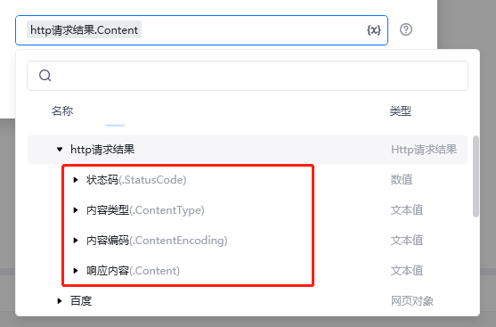
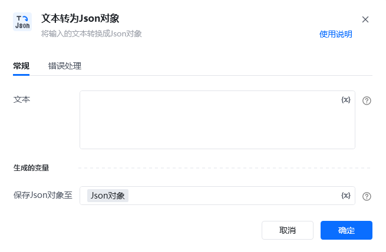
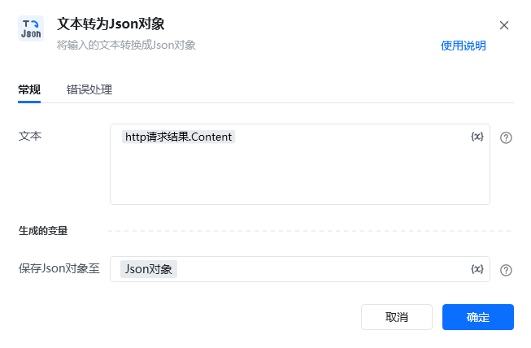
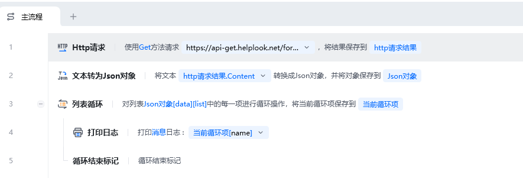
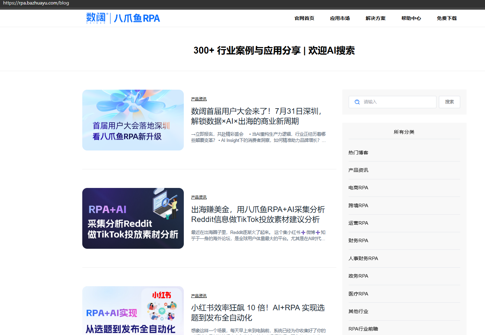
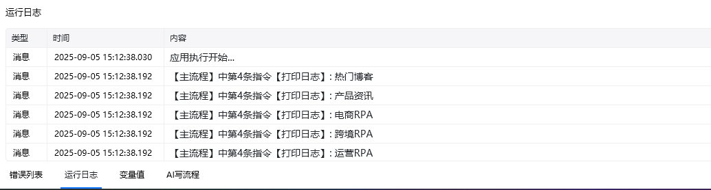
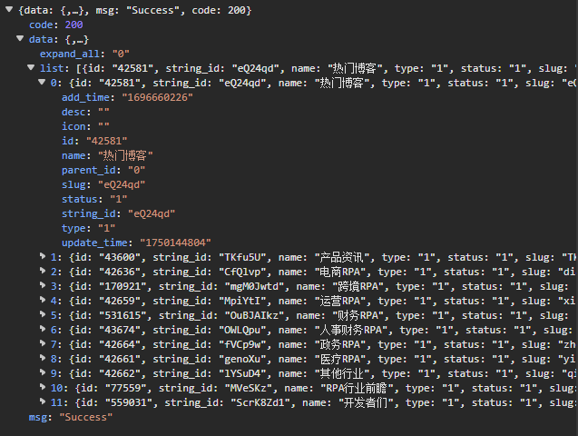
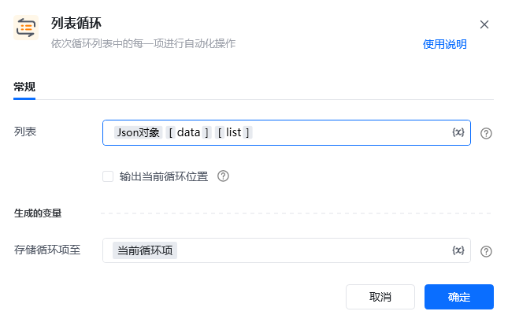

## 指令说明

**描述：**

## 参数说明

<Tabs>
  <Tab title="常规">
    

    | 参数 | 说明 |
    | --- | --- |
    | **文本** | 输入待转换成Json对象的文本 |
    | **生成的变量** | 保存Json对象至：输入一个名字,用来保存转换得到的Json对象 |
  </Tab>
  <Tab title="高级">
    本指令暂无高级参数。
  </Tab>
</Tabs>

## 使用示例

**该流程执行逻辑：**

1.编写Json解析表达式，以“[]”分隔，每个"[key]"为一层属性值的索引，例如：json对象变量[data]，代表获取Json对象类型变量“json对象变量”下的data属性的内容结果；json对象变量[data][title]，代表获取Json对象类型变量“json对象变量”下的data属性下的title属性的内容结果；

2.如解析内容结果的类型为列表类型，支持对解析内容结果使用数字索引或可使用列表循环指令提取列表项，再对提取出来的列表项进行Json解析；

列表变量为Json对象时，Json解析表达式的“[ ]”需选择运算符

### 效果展示

<Info>
  使用指令过程中遇到问题？前往 [八爪鱼RPA 开发者社区问答板块](https://rpa.bazhuayu.com/community/questions) 提问，获取官方与社区帮助。
</Info>
