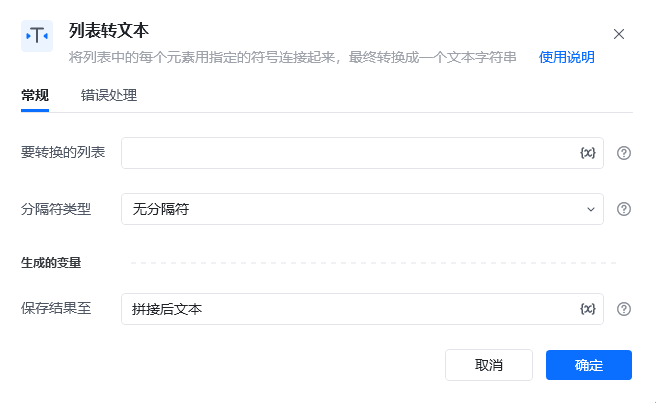
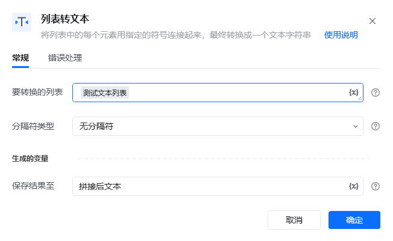
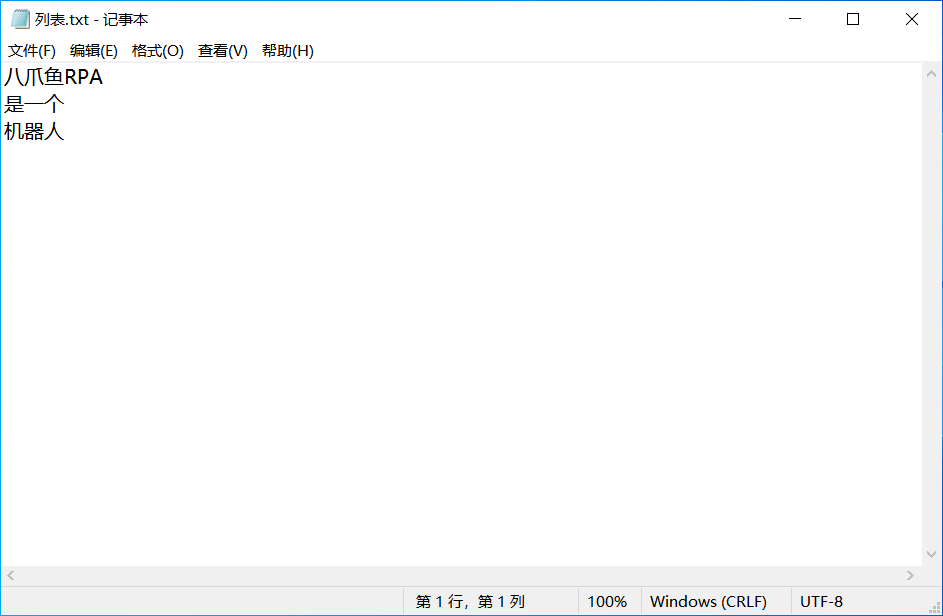
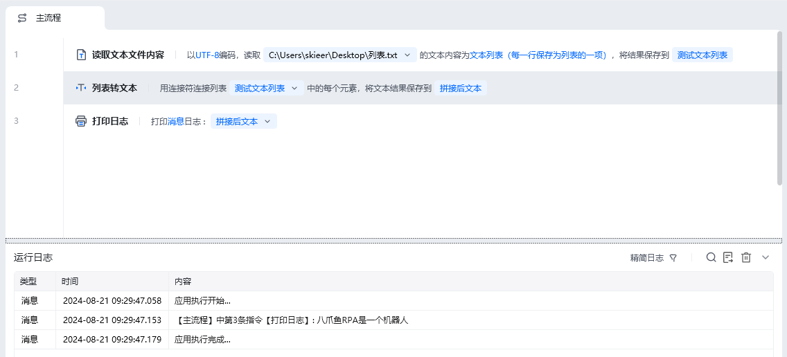

## 指令说明

**描述：** 将列表中的每一项内容合并起来，以字符串的形式呈现

## 参数说明

<Tabs>
  <Tab title="常规">
    

    | 参数 | 说明 |
    | --- | --- |
    | **要合并的列表** | 输入待合并的列表 |
    | **保存结果至** | 将合并后的文本保存为变量 |
  </Tab>
  <Tab title="高级">
    本指令暂无高级参数。
  </Tab>
</Tabs>

## 使用示例

**该流程执行逻辑：**

本例演示【列表转文本】指令的配置与执行：

1. 选择需要合并的列表变量。
2. 将列表项拼接为文本，并把结果保存到指定变量。

### 效果展示

<Info>
  使用指令过程中遇到问题？前往 [八爪鱼RPA 开发者社区问答板块](https://rpa.bazhuayu.com/community/questions) 提问，获取官方与社区帮助。
</Info>
