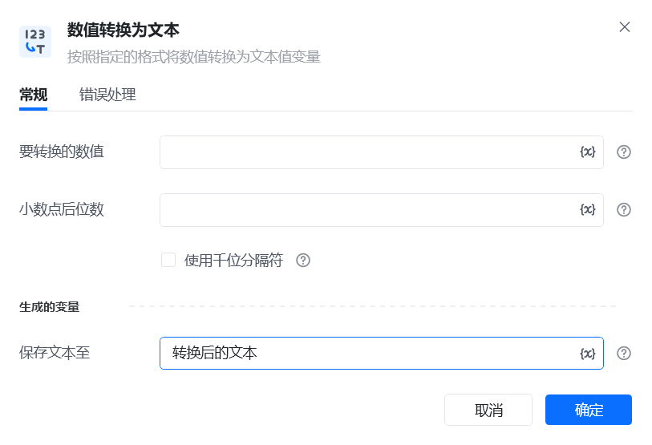
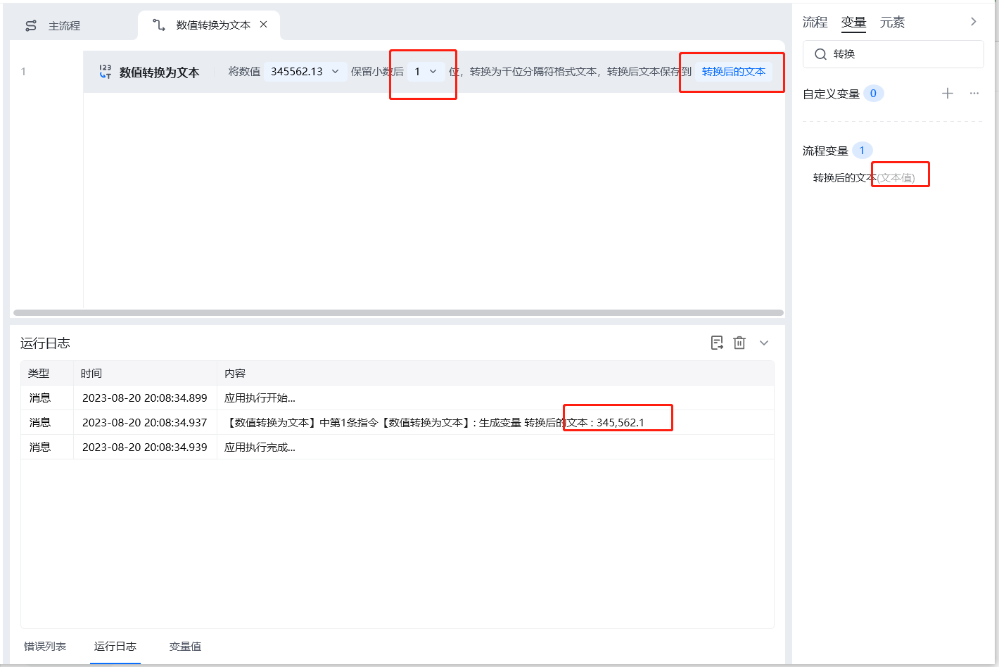

## 指令说明

**描述：** 将数值转换为文本类型的变量

## 参数说明

<Tabs>
  <Tab title="常规">
    

    | 参数 | 说明 |
    | --- | --- |
    | **要转换的数值** | 输入一个要转为文本的数值或数值变量 |
    | **小数点后位数** | 填入数字，保留小数点后的第几位数，比如填入1，即保留小数点后的1位数 |
    | **使用千位分隔符** | 是否使用标点符号作为千位分隔符 |
    | **保存文本至** | 指定一个变量名称，该变量用于保存数值转换为文本后的结果 |
  </Tab>
  <Tab title="高级">
    本指令暂无高级参数。
  </Tab>
</Tabs>

## 使用示例

**该流程执行逻辑：**

1. 输入需要转换的数值，并设置小数位数和是否使用千位分隔符。
2. 将数值转换为文本，并将结果保存到指定变量。

### 效果展示

执行完成后，数字将转换为文本并保存至指定变量。

<Info>
  使用指令过程中遇到问题？前往 [八爪鱼RPA 开发者社区问答板块](https://rpa.bazhuayu.com/community/questions) 提问，获取官方与社区帮助。
</Info>
