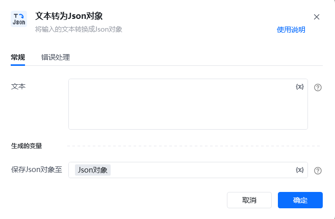
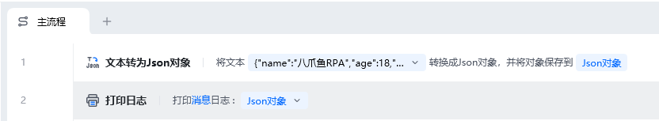
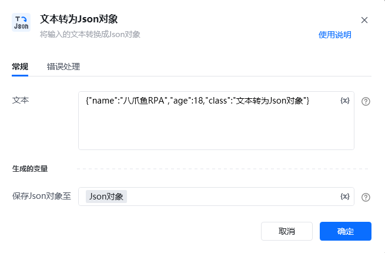
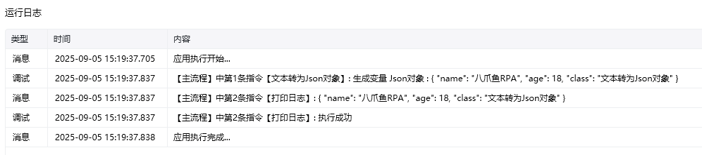

## 指令说明

**描述：** 将输入的文本转换成Json对象

## 参数说明

<Tabs>
  <Tab title="常规">
    

    | 参数 | 说明 |
    | --- | --- |
    | **文本** | 输入待转换成Jason对象的文本 |
    | **生成的变量** | 保存转换后的Json为变量 |
  </Tab>
  <Tab title="高级">
    本指令暂无高级参数。
  </Tab>
</Tabs>

## 使用示例

**该流程执行逻辑：**

使用【文本转为Json对象】将文本`{"name":"八爪鱼RPA","age":18,"class":"文本转为Json对象"}`转换成Json对象，并将对象保存到Json对象

使用【打印日志】命令打印Json对象消息日志

### 运行结果

<Info>
  使用指令过程中遇到问题？前往 [八爪鱼RPA 开发者社区问答板块](https://rpa.bazhuayu.com/community/questions) 提问，获取官方与社区帮助。
</Info>
