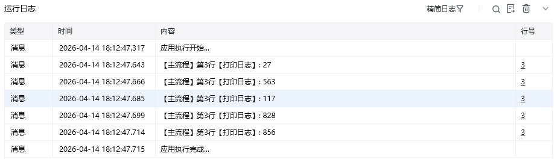

## 指令说明

**描述：** 用于产生随机数，用户自行指定随机数范围的最小数和最大数

## 参数说明

<Tabs>
  <Tab title="常规">
    

    | 参数 | 说明 |
    | --- | --- |
    | **最小数** | 随机数取值范围的下限（含该数字） |
    | **最大数** | 随机数取值范围的上限（含该数字） |
  </Tab>
  <Tab title="高级">
    本指令暂无高级参数。
  </Tab>
</Tabs>

## 使用示例

**该流程执行逻辑：**

全部流程循环5次 ---> 循环体中使用【产生随机数】指令在最小数1与最大数999之间产生随机数并保存 ---> 把随机数打印在控制台

### 效果展示

<Info>
  使用指令过程中遇到问题？前往 [八爪鱼RPA 开发者社区问答板块](https://rpa.bazhuayu.com/community/questions) 提问，获取官方与社区帮助。
</Info>
