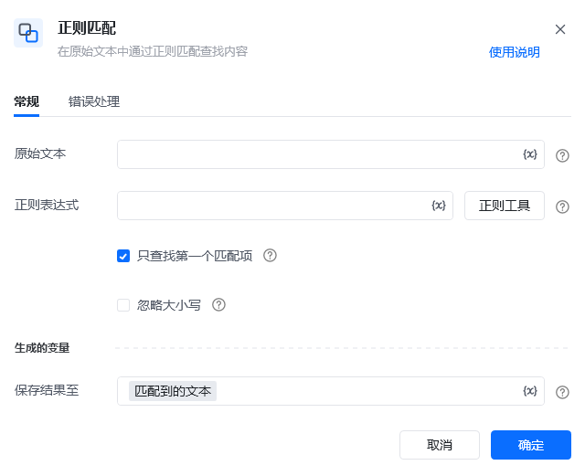
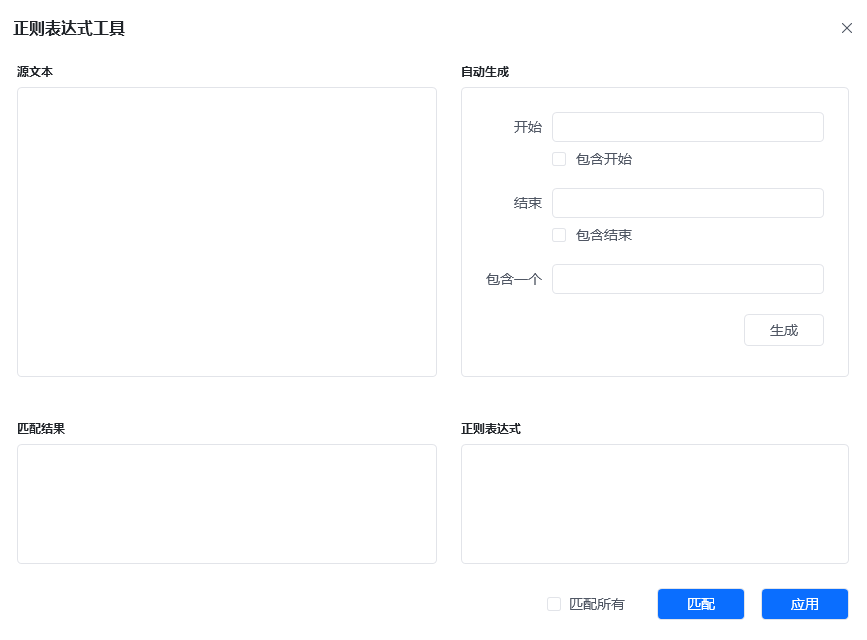
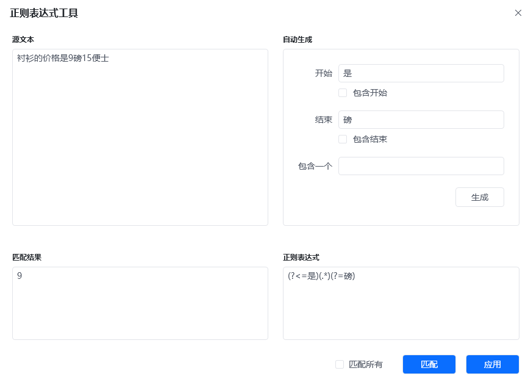
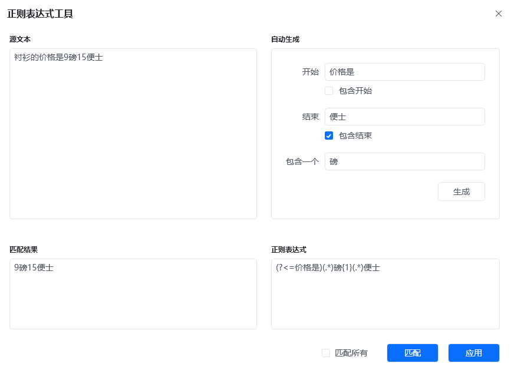
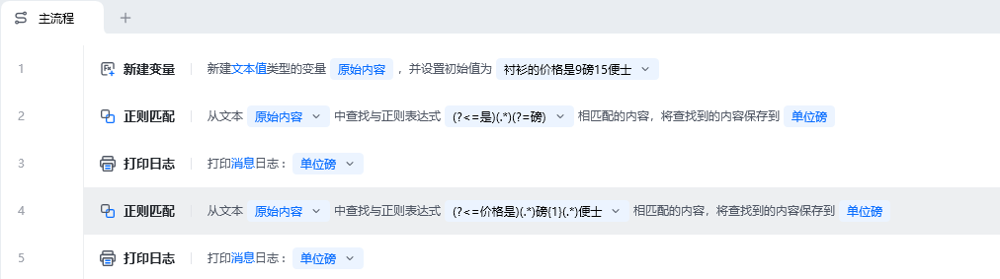
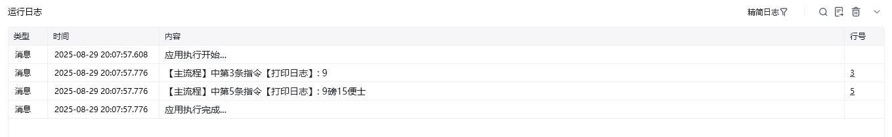

## 指令说明

**描述：**在原始文本中通过正则匹配查找内容

## 参数说明

<Tabs>
  <Tab title="常规">
    

    | 参数 | 说明 |
    | --- | --- |
    | **原始文本** | 输入文本字符串或者选择一个包含字符串的变量 |
    | **正则表达式** | 输入一段正则表达式（亦可通过正则工具生成） |
    | **只查找第一个匹配项** | 是否只查找第一个匹配项 |
    | **忽略大小写** | 在字符串匹配时，是否忽略大小写 |
    | **源文本** | 原始文本 |
    | **开始** | 自动生成正则表达式：以某个字符或字符串开始。（匹配结果可以勾选是否包含开始） |
    | **结束** | 自动生成正则表达式：以某个字符或字符串结束。（匹配结果可以勾选是否包含开始） |
    | **包含一个** | 自动生成正则表达式：「开始」与「结束」可以包含某个字符或字符串。 |
    | **匹配结果** | 根据自动生成的正则表达式，所匹配出来的结果。 |
    | **正则表达式** | 自动生成的正则表达式 |
  </Tab>
  <Tab title="高级">
    
  </Tab>
</Tabs>

## 使用示例

**该流程执行逻辑：**

新建字符串变量「原始内容」：衬衫的价格是9磅15便士；

使用【正则匹配】指令从字符串变量中正则匹配出来以「是」开始、「磅」结束，之间的文本内容，并打印出来；

使用【正则匹配】指令从字符串变量中正则匹配出来以「价格是」开始、「便是」结束、中间包含「磅」的文本内容，并打印出来；

### 效果展示

<Info>
  使用指令过程中遇到问题？前往 [八爪鱼RPA 开发者社区问答板块](https://rpa.bazhuayu.com/community/questions) 提问，获取官方与社区帮助。
</Info>
