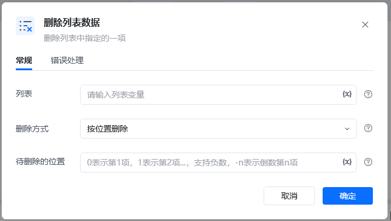
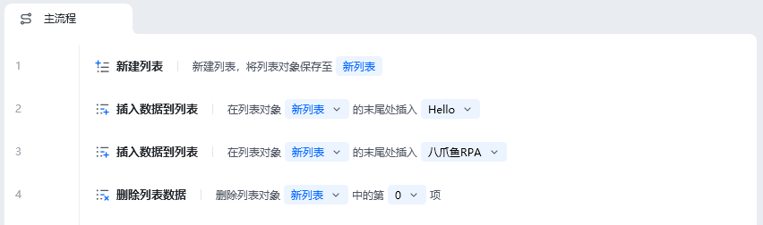
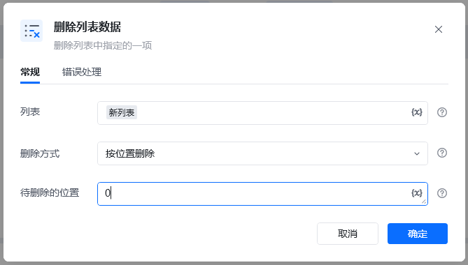
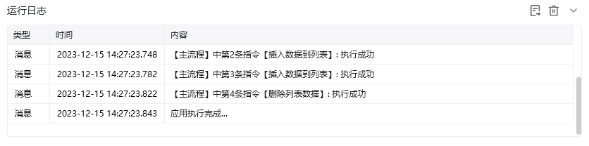
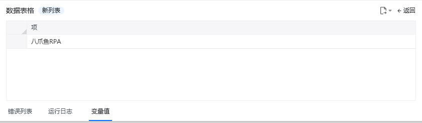

## 指令说明

**描述：** 删除列表中指定的一项

## 参数说明

<Tabs>
  <Tab title="常规">
    

    | 参数 | 说明 |
    | --- | --- |
    | **列表** | 输入列表变量 |
    | **删除方式** | 按位置删除或按内容删除 |
    | **待删除位置** | 输入待删除项的位置，0表示第1项，1表示第2项...... |
    | **待删除内容** | 输入待删除项的内容 |
  </Tab>
  <Tab title="高级">
    本指令暂无高级参数。
  </Tab>
</Tabs>

## 使用示例

**该流程执行逻辑：**

### 运行结果

<Info>
  使用指令过程中遇到问题？前往 [八爪鱼RPA 开发者社区问答板块](https://rpa.bazhuayu.com/community/questions) 提问，获取官方与社区帮助。
</Info>
