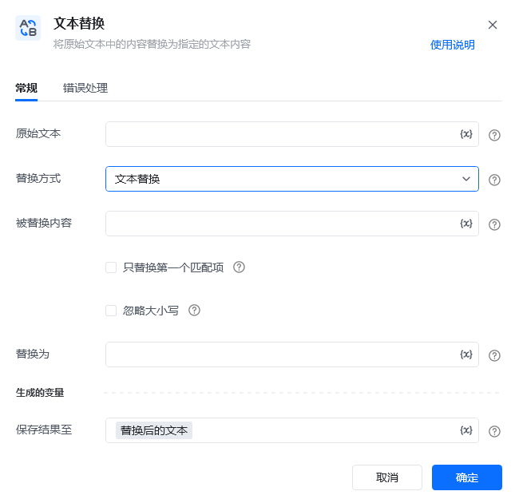
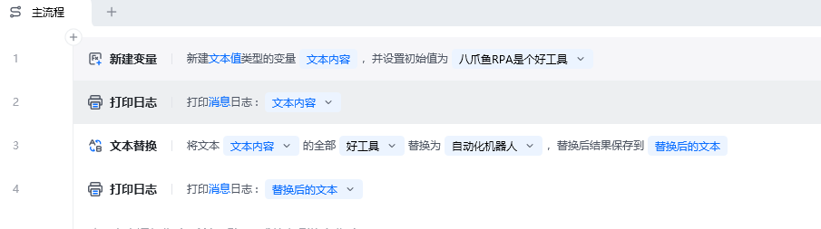
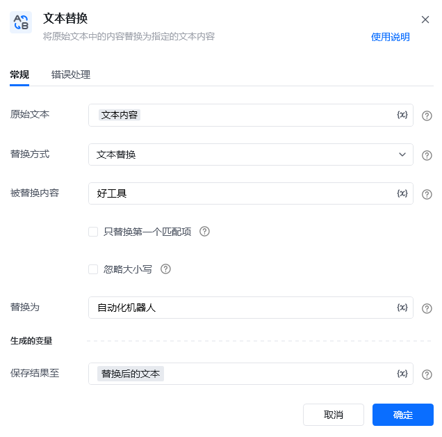
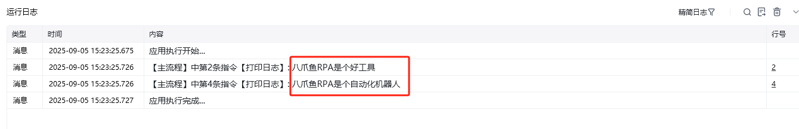

## 指令说明

**描述：** 将原始文本中的内容替换为指定的文本内容

## 参数说明

<Tabs>
  <Tab title="常规">
    

    | 参数 | 说明 |
    | --- | --- |
    | **原始文本** | 输入文本字符串或者选择一个包含字符串的变量 |
    | **替换方式** | 选择一种内客的替换方式： 文本替换：需填写「被替换内容」、 正则替换：需填写「正则表达式」 |
    | **被替换内容** | 填入被替换的内容 |
    | **正则表达式** | 填入匹配内容的正则表达式 |
    | **只替换第一个匹配项** | 是否只替换第一个匹配项 |
    | **忽略大小写** | 是否忽略大小写 |
    | **替换为** | 输入匹配到的内容 替换为，支持替换为空 |
  </Tab>
  <Tab title="高级">
    本指令暂无高级参数。
  </Tab>
</Tabs>

## 使用示例

**该流程执行逻辑：**

将文本内容“八爪鱼RPA是个好工具”中的“好工具”字符串替换为“自动化机器人”，即输出了“八爪鱼RPA是个自动化机器人”。

### 运行结果

<Info>
  使用指令过程中遇到问题？前往 [八爪鱼RPA 开发者社区问答板块](https://rpa.bazhuayu.com/community/questions) 提问，获取官方与社区帮助。
</Info>
