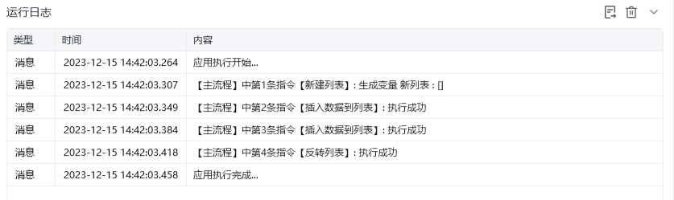
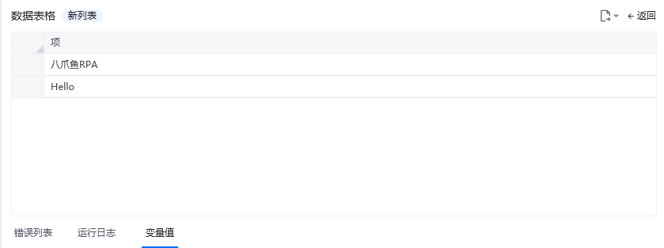

## 指令说明

**描述：** 将列表中的数据项按当前顺序反向排列，并将处理后的列表保存到指定变量中。

## 参数说明

<Tabs>
  <Tab title="常规">

    

    | 参数 | 说明 |
    | --- | --- |
    | **列表** | 输入列表变量 |
  </Tab>
  <Tab title="高级">
    本指令暂无高级参数。
  </Tab>
</Tabs>

## 使用示例

**该流程执行逻辑：**

1. 选择需要处理的列表变量。
2. 执行【反转列表】，将列表第一项与最后一项的顺序完全对调。
3. 将反转后的列表保存到结果变量，供后续读取、循环或输出使用。

### 效果展示

<Info>
  使用指令过程中遇到问题？前往 [八爪鱼RPA 开发者社区问答板块](https://rpa.bazhuayu.com/community/questions) 提问，获取官方与社区帮助。
</Info>
