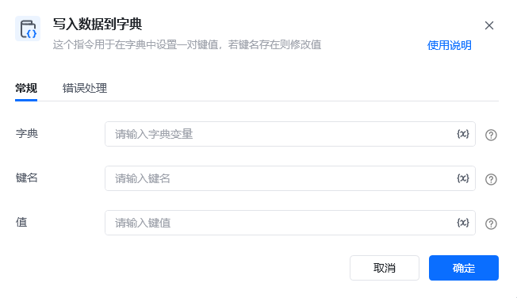
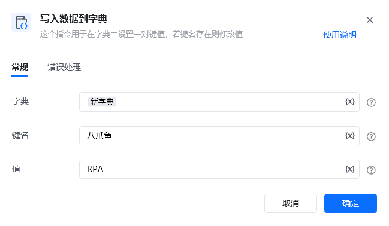
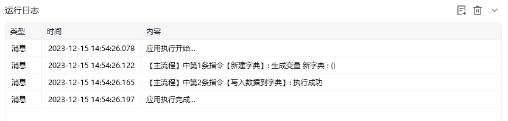
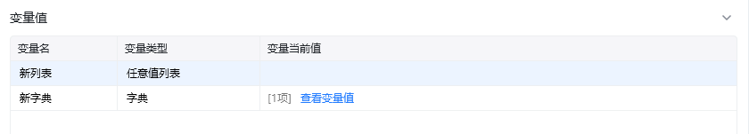
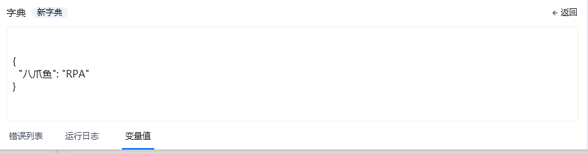

## 指令说明

**描述：** 在字典中设置一对键值，若键名存在则修改值

## 参数说明

<Tabs>
  <Tab title="常规">

    

    | 参数 | 说明 |
    | --- | --- |
    | **字典** | 输入字典变量 |
    | **键名** | 输入键名 |
    | **值** | 输入键值 |
  </Tab>
  <Tab title="高级">
    本指令暂无高级参数。
  </Tab>
</Tabs>

## 使用示例

**该流程执行逻辑：**

本例演示【写入数据到字典】指令的配置与执行：

1. 选择要写入的字典变量，并设置键名和值。
2. 将该键值对写入字典；键名已存在时更新其对应的值。

### 效果展示

<Info>
  使用指令过程中遇到问题？前往 [八爪鱼RPA 开发者社区问答板块](https://rpa.bazhuayu.com/community/questions) 提问，获取官方与社区帮助。
</Info>
