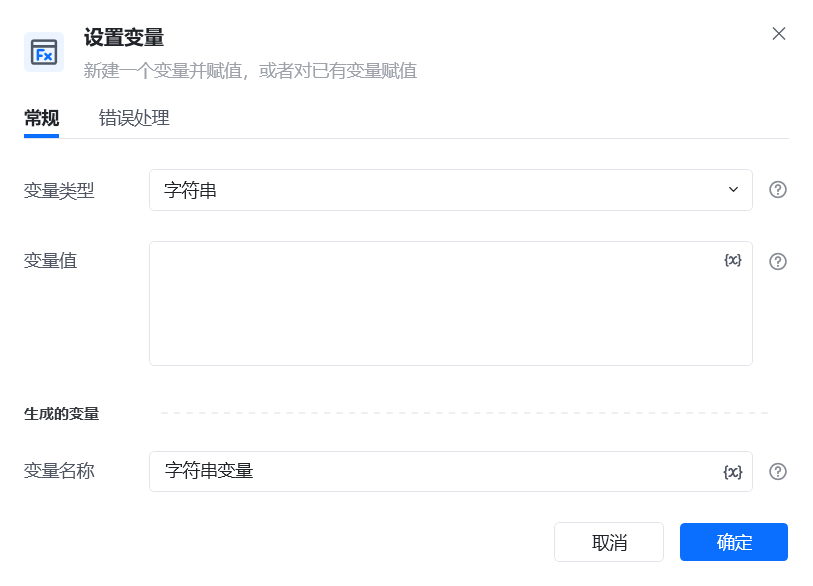
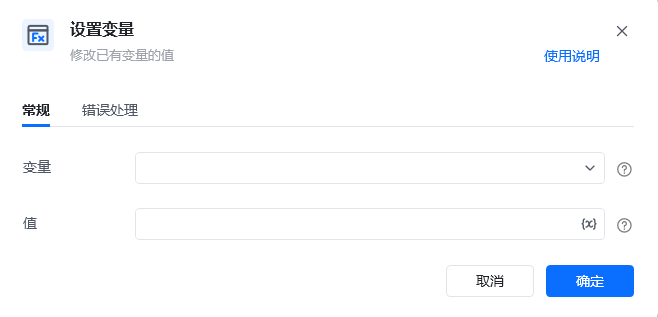
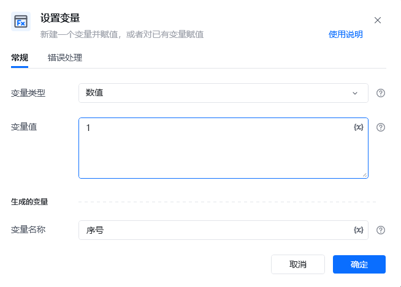
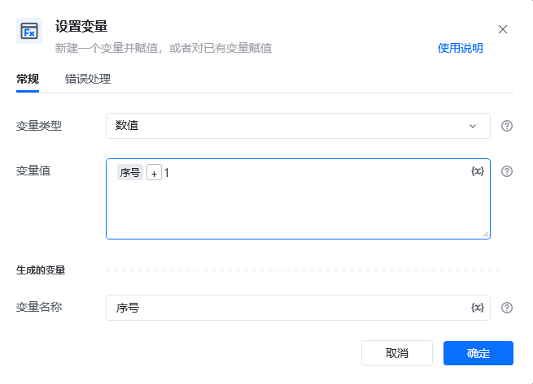
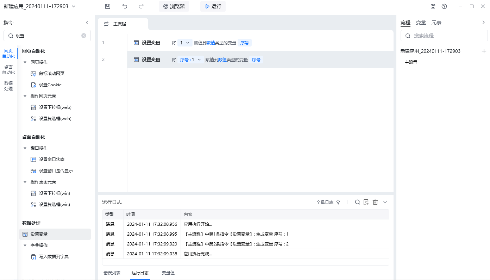
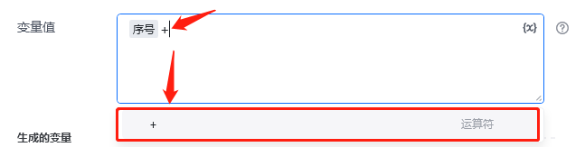
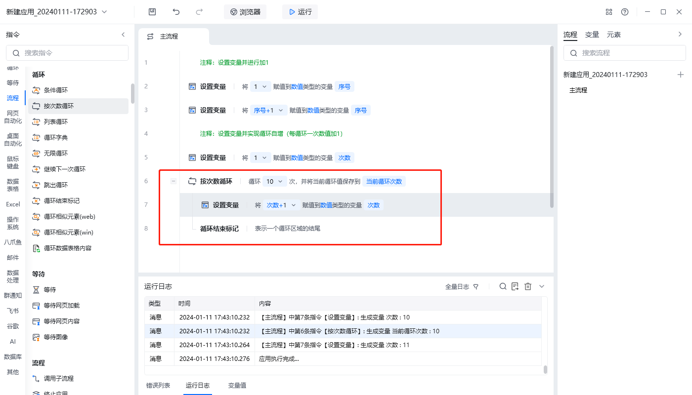
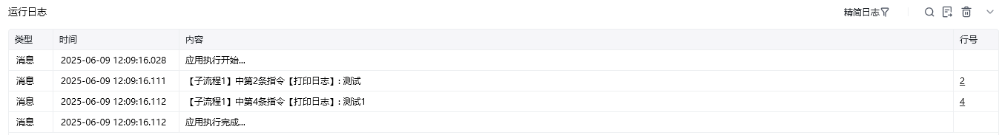

## 指令说明

**描述：**新建一个变量并赋值，或者对已有的变量赋值

## 参数说明

<Tabs>
  <Tab title="常规">

    

    

    | 参数 | 说明 |
    | --- | --- |
    | **变量类型** | 变量的类型可以选择为：数值、布尔值或字符串 |
    | **变量值** | 直接输入变量的值，或选择已有的变量给它赋值 |
    | **生成的变量名称** | 可以新建一个名字作为变量的的名字，也可以选择已有的变量，给它赋值 |
  </Tab>
  <Tab title="高级">
  </Tab>
</Tabs>

## 使用示例

**该流程执行逻辑：**

本例演示【设置变量（1.x版本）】指令的配置与执行：

1. 使用【新建变量】创建数值变量“序号”，初始值设为 `1`。
2. 执行【设置变量】，选择“序号”，将值设置为“序号 + 1”。输入加号后需选择运算符，才能执行数值运算。
3. 使用【打印日志】输出“序号”，结果为 `2`；把步骤 2 放入循环后，可在每次循环中让序号递增。

完整循环示例：[打开应用示例](https://rpa.bazhuayu.com/shareableLink/659fb8a45d1eb11125dd25a9)

### 效果展示

<Info>
  使用指令过程中遇到问题？前往 [八爪鱼RPA 开发者社区问答板块](https://rpa.bazhuayu.com/community/questions) 提问，获取官方与社区帮助。
</Info>
