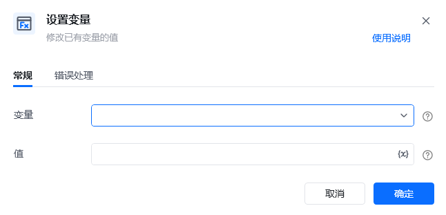
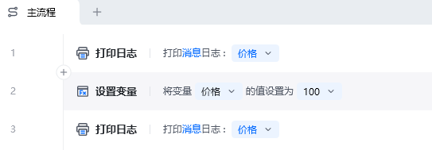
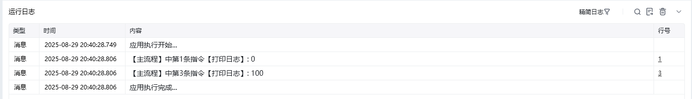

## 指令说明

**描述：** 修改已有变量的值，常与【新建变量】指令连用

## 参数说明

<Tabs>
  <Tab title="常规">
    

    | 参数 | 说明 |
    | --- | --- |
    | **变量** | 请选择一个现有的变量 |
    | **值** | 可以根据变量类型自动转换值的数据类型，如数字和文本，布尔值和文本，任意值与其他类型（转换失败则提示：类型不匹配，变量“xxx”已被声明为“文本值”类型） |
  </Tab>
  <Tab title="高级">
    本指令暂无高级参数。
  </Tab>
</Tabs>

## 使用示例

**该流程执行逻辑：**

1. 先使用【打印日志】输出变量“价格”的初始值，本例初始值为 `0`。
2. 执行【设置变量（2.x版本）】，将“价格”的值修改为 `100`。
3. 再次打印“价格”，确认变量已经更新为 `100`，后续流程将使用新值。

### 效果展示

<Info>
  使用指令过程中遇到问题？前往 [八爪鱼RPA 开发者社区问答板块](https://rpa.bazhuayu.com/community/questions) 提问，获取官方与社区帮助。
</Info>
