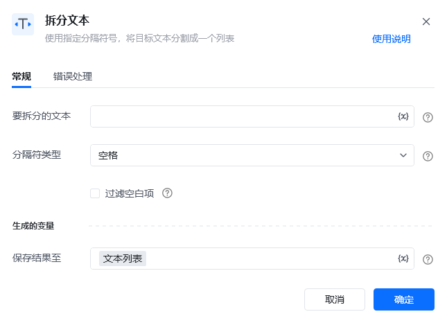
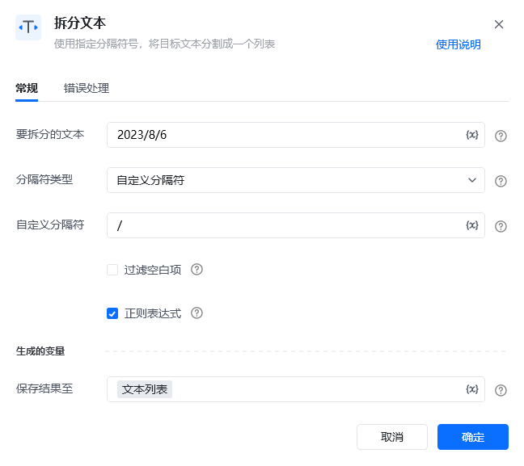
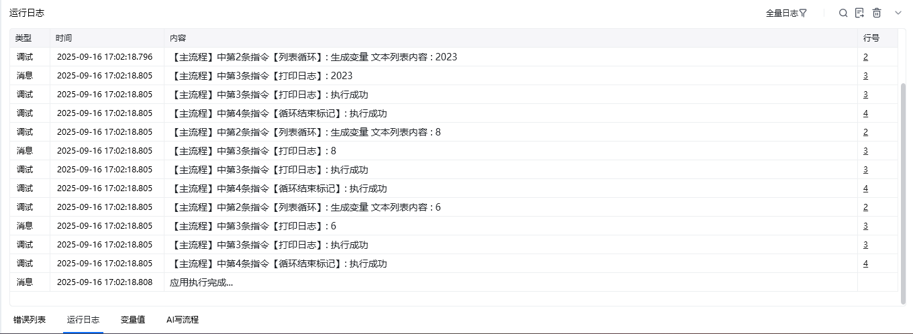

## 指令说明

**描述：** 自定义或选择指定的分隔符，将文本分割成一个列表

## 参数说明

<Tabs>
  <Tab title="常规">
    

    | 参数 | 说明 |
    | --- | --- |
    | **要拆分的文本** | 输入待分割的文本内容或字符串变量 |
    | **分割符类型** | 标准分隔符：空格符/换行符/制表符 、 自定义分隔符：使用自定义的符号作为分隔符，支持正则匹配分隔 |
    | **过滤空白项** | 勾选则自动过滤空白变量 |
    | **保存结果至** | 指定一个列表变量名称,将分割后的列表保存在该列表变量中 |
  </Tab>
  <Tab title="高级">
    本指令暂无高级参数。
  </Tab>
</Tabs>

## 使用示例

**该流程执行逻辑：**

### 运行结果

<Info>
  使用指令过程中遇到问题？前往 [八爪鱼RPA 开发者社区问答板块](https://rpa.bazhuayu.com/community/questions) 提问，获取官方与社区帮助。
</Info>
