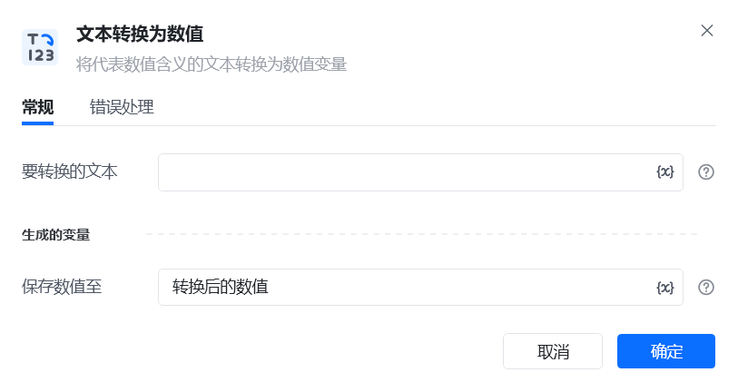
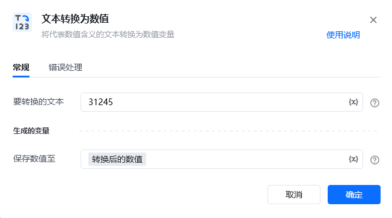
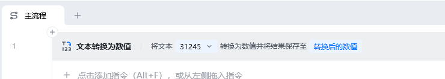
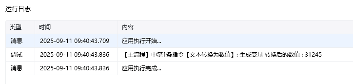

## 指令说明

**描述：** 将文本类型的数字转换为数值类型

## 参数说明

<Tabs>
  <Tab title="常规">
    

    | 参数 | 说明 |
    | --- | --- |
    | **要转换的文本** | 输入一个仅包含数值的字符串或文本变量，用于转换为数值变量。空格将被忽略，出现非数值文本将会报错 |
    | **保存数值至** | 将装换后的数值保存到变量 |
  </Tab>
  <Tab title="高级">
    本指令暂无高级参数。
  </Tab>
</Tabs>

## 使用示例

**该流程执行逻辑：**

1. 准备内容为 `324425` 的文本变量，并将其传入【文本转换为数值】。
2. 指令解析文本并生成数值类型的结果 `324425`。
3. 将数值结果保存到变量后，可继续参与计算、大小比较或数值格式化。

### 效果展示

<Info>
  使用指令过程中遇到问题？前往 [八爪鱼RPA 开发者社区问答板块](https://rpa.bazhuayu.com/community/questions) 提问，获取官方与社区帮助。
</Info>
