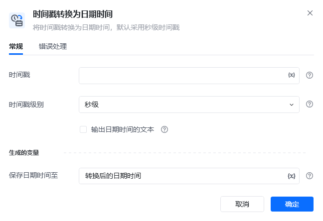
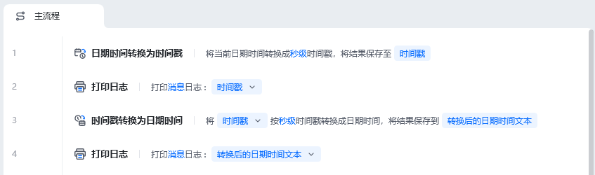
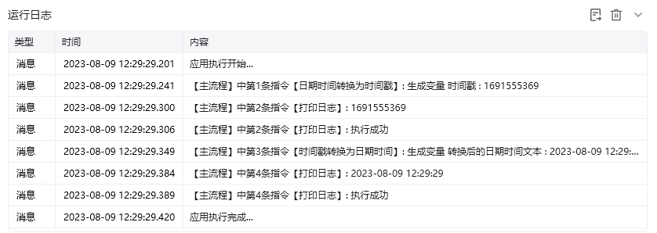

## 指令说明

**描述：** 将时间戳转换为日期时间，默认采用秒级时间戳

## 参数说明

<Tabs>
  <Tab title="常规">

    

    | 参数 | 说明 |
    | --- | --- |
    | **时间戳** | 输入待转换到日期时间的时间戳 |
    | **时间戳级别** | 选择时间戳级别，分别为秒级、毫秒级、微秒级 |
    | **生成的变量** | 保存日期时间变量 |
  </Tab>
  <Tab title="高级">
    本指令暂无高级参数。
  </Tab>
</Tabs>

## 使用示例

**该流程执行逻辑：**

1. 先使用【日期时间转换为时间戳】将系统当前时间转换为时间戳，并打印该数值作为对照。
2. 将时间戳传入【时间戳转换为日期时间】，按配置的时区和格式生成日期时间结果。
3. 使用【打印日志】输出转换后的日期时间文本，确认结果与原始时间一致。

### 效果展示

<Info>
  使用指令过程中遇到问题？前往 [八爪鱼RPA 开发者社区问答板块](https://rpa.bazhuayu.com/community/questions) 提问，获取官方与社区帮助。
</Info>
