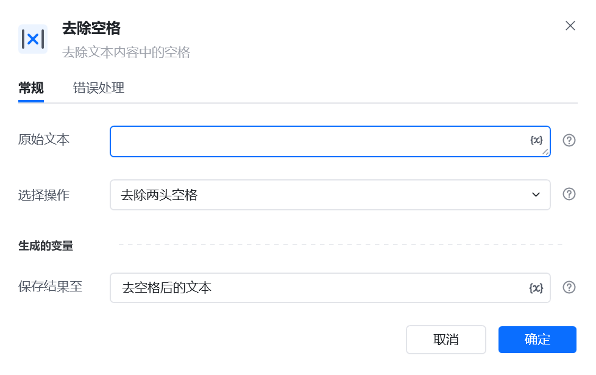
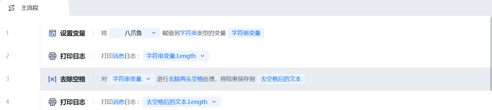
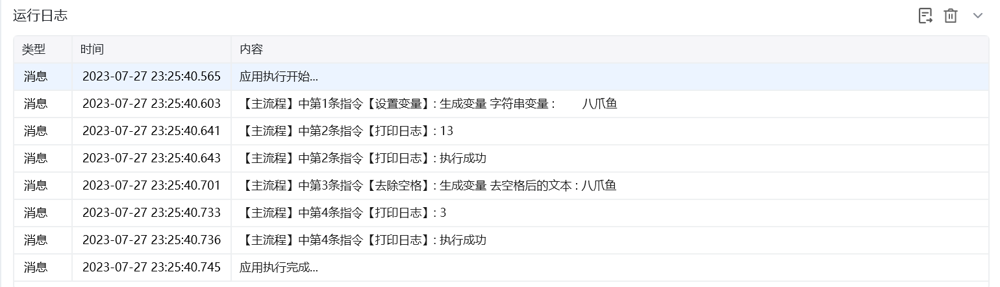

## 指令说明

**描述：** 去除文本内容中的空格

## 参数说明

<Tabs>
  <Tab title="常规">

    

    | 参数 | 说明 |
    | --- | --- |
    | **原始文本：** | 输入文本字符串或者选择一个包含字符串的变量 |
    | **选择操作：** | 去除两头空格/去除开头空格/去除结尾空格 |
    | **保存结果至：** | 保存内容至变量 |
  </Tab>
  <Tab title="高级">
    本指令暂无高级参数。
  </Tab>
</Tabs>

## 使用示例

**该流程执行逻辑：**

使用【设置变量】设置带空格的字符串变量： 八爪鱼

使用【打印日志】字符串的文本长度：13

使用【去除空格】指令为字符串变量去除两头的空格，将结果保存至变量

使用【打印日志】指令打印去除空格后的变量的文本长度：3

### 效果展示

<Info>
  使用指令过程中遇到问题？前往 [八爪鱼RPA 开发者社区问答板块](https://rpa.bazhuayu.com/community/questions) 提问，获取官方与社区帮助。
</Info>
