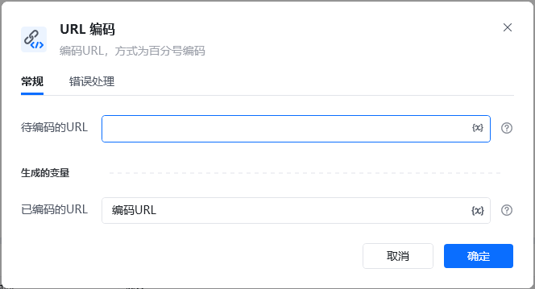
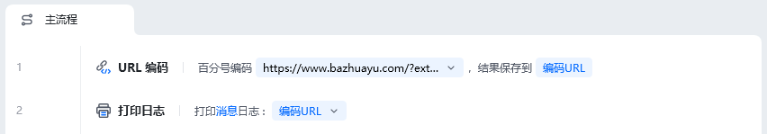
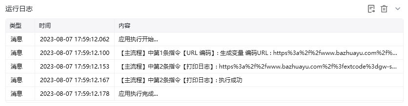

## 指令说明

**描述：** 编码URL，方式为百分号编码

## 参数说明

<Tabs>
  <Tab title="常规">
    

    | 参数 | 说明 |
    | --- | --- |
    | **待编码的URL** | 输入待编码的URL |
    | **生成变量** | 生成已编码的URL |
  </Tab>
  <Tab title="高级">
    本指令暂无高级参数。
  </Tab>
</Tabs>

## 使用示例

**该流程执行逻辑：**

编码前的网址：https://www.bazhuayu.com/?extcode=gw-sk-yl-no-no-no

编码后的网址：https%3a%2f%2fwww.bazhuayu.com%2f%3fextcode%3dgw-sk-yl-no-no-no

使用【URL编码】命令百分号编码网址，结果保存到编码URL

使用【打印日志】打印编码URL消息日志

### 运行结果

<Info>
  使用指令过程中遇到问题？前往 [八爪鱼RPA 开发者社区问答板块](https://rpa.bazhuayu.com/community/questions) 提问，获取官方与社区帮助。
</Info>
