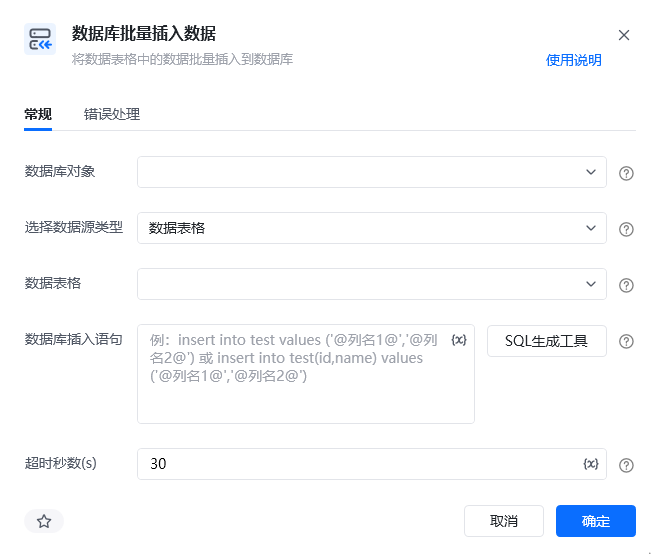
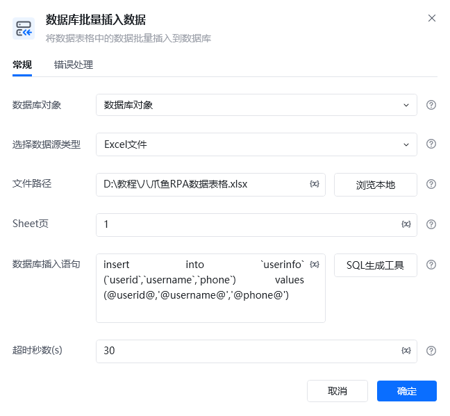
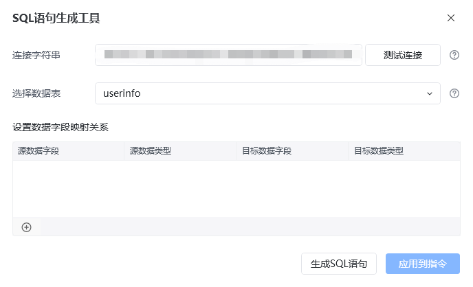
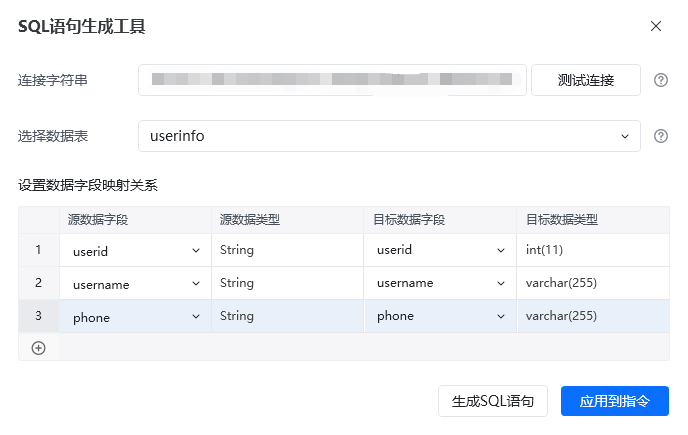
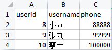
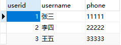
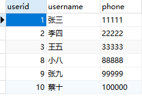
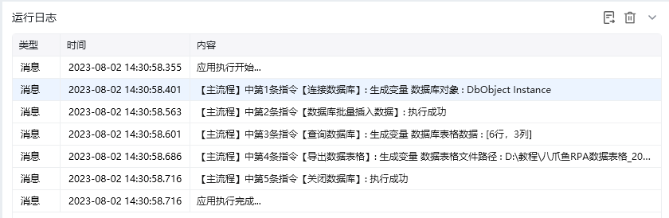

## 指令说明

**描述：**将数据表格中的数据批量插入到数据库

## 参数说明

<Tabs>
  <Tab title="常规">

    

    | 参数 | 说明 |
    | --- | --- |
    | **数据库对象** | 选择已经创建好的数据库对象 |
    | **选择数据源类型** | 1、数据表格 选择一个数据表格对象或者通过“导入excel/csv至数据表格”创建的数据表格对象、 2、Excel文件 文件路径：输入/选择 文件的绝对路径；、 Sheet页：输入Sheet页的名称或序号，第一个Sheet页的序号为1 |
    | **数据库插入语句** | 输入数据库插入SQL语句，支持使用变量，并以@作为匹配标识符，可通过【SQL生成工具】生成 |
    | **超时秒数（s）** | 设置数据库查询最大超时秒数 |
    | **连接字符串** | 输入连接数据库的字符串（数据库地址、账号、密码、端口等） |
    | **选择数据表** | 选择所需连接的数据库表 |
    | **设置数据字段映射关系** | 源数据字段，源数据类型，目标数据字段，目标数据类型、 其中源数据字段，指Excel工作表中的列头字段、 目标数据字段，指写入数据库的字段 |
  </Tab>
  <Tab title="高级">
  </Tab>
</Tabs>

## 使用示例

**该流程执行逻辑：**

使用【连接数据库】配置Mysql连接，创建数据库对象，并保存到数据库对象

使用【数据库批量插入数据】在数据库对象中插入本地表格文件第1页数据

使用【查询数据库】执行查询语句"select * from userinfo;"，将结果保存到数据库表格数据

使用【导出数据表格】导出数据库表格为Excel文件，并定义表格Sheet页为表1

使用【关闭数据库】指令关闭数据库连接

### 效果展示

<Info>
  使用指令过程中遇到问题？前往 [八爪鱼RPA 开发者社区问答板块](https://rpa.bazhuayu.com/community/questions) 提问，获取官方与社区帮助。
</Info>
