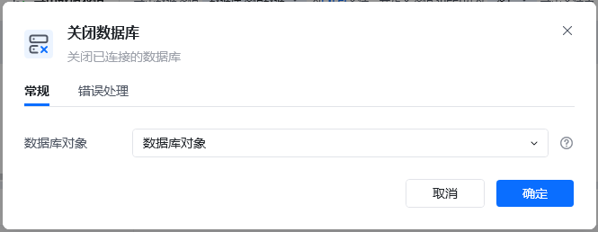
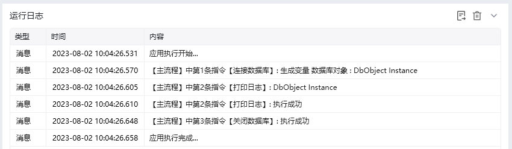

## 指令说明

**描述：** 关闭已连接的数据库

## 参数说明

<Tabs>
  <Tab title="常规">
    

    | 参数 | 说明 |
    | --- | --- |
    | **数据库对象** | 选择已经创建好的数据库对象 |
  </Tab>
  <Tab title="高级">
    本指令暂无高级参数。
  </Tab>
</Tabs>

## 使用示例

**该流程执行逻辑：**

使用【连接数据库】配置Mysql连接，创建数据库对象，并保存到数据库对象

使用【打印日志】打印数据库对象消息日志

使用【关闭数据库】指令关闭数据库连接

### 运行结果

<Info>
  使用指令过程中遇到问题？前往 [八爪鱼RPA 开发者社区问答板块](https://rpa.bazhuayu.com/community/questions) 提问，获取官方与社区帮助。
</Info>
