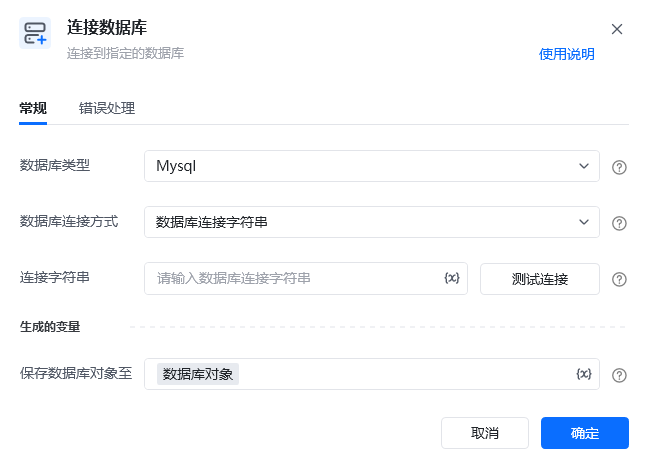
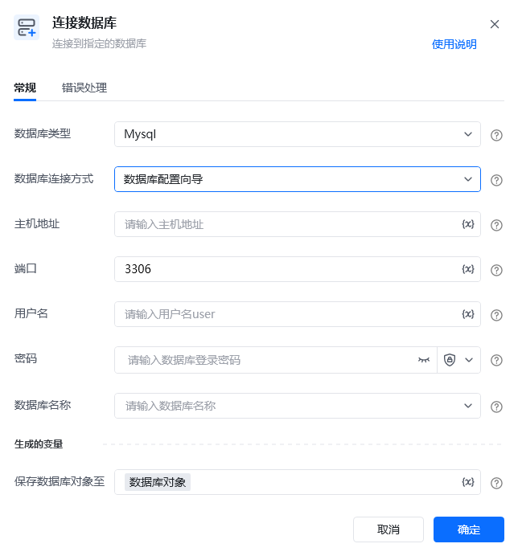
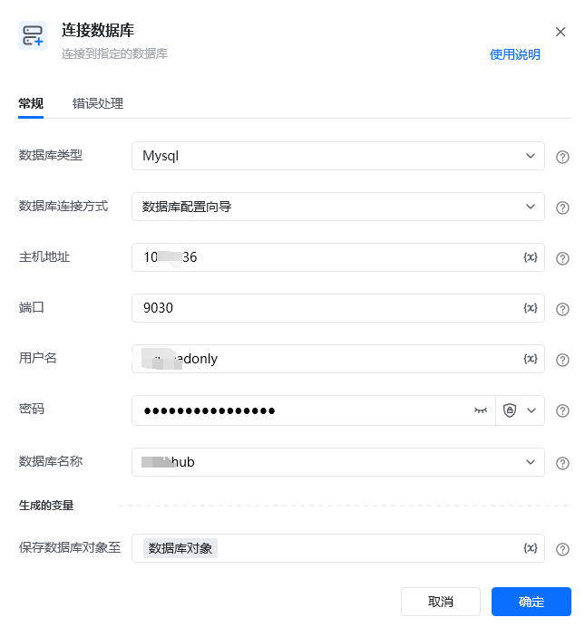
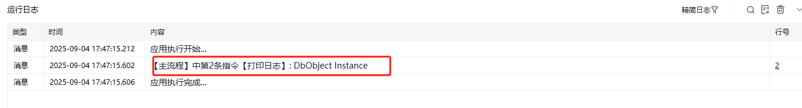

## 指令说明

**描述：**连接到指定的数据库

## 参数说明

<Tabs>
  <Tab title="常规">
    

    | 参数 | 说明 |
    | --- | --- |
    | **数据库类型** | 选择数据库的类型：SQLServer、Mysql、PostgreSQL |
    | **数据库连接方式** | 请选择数据库连接方式： 数据库连接字符串：、 数据库配置向导：根据字段要求填写各项数据库参数（推荐使用） |
    | **连接字符串** | 以Mysql为例，连接字符串样式为： Server=myServerAddress;Database=myDataBase;Uid=myUsername;Pwd=myPassword; |
    | **主机地址** | 输入host主机地址 |
    | **端口** | 输入数据库端口 |
    | **用户名** | 输入用户名user |
    | **密码** | 输入数据库登录密码 |
    | **数据库名称** | 输入或选择数据库名称 |
  </Tab>
  <Tab title="高级">
    
  </Tab>
</Tabs>

## 使用示例

**该流程执行逻辑：**

使用【连接数据库】指令配置Mysql连接，使用「数据库配置向导」方式，输入对应的数据库配置信息，并保存到数据库对象；并打印对象；

### 运行结果

<Info>
  使用指令过程中遇到问题？前往 [八爪鱼RPA 开发者社区问答板块](https://rpa.bazhuayu.com/community/questions) 提问，获取官方与社区帮助。
</Info>
