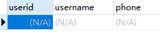
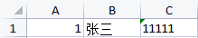
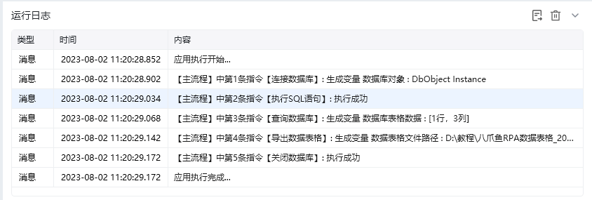
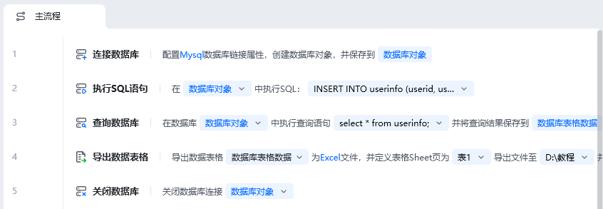
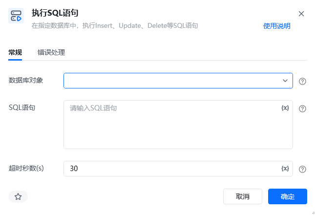

## 指令说明

**描述：** 在指定数据库中，执行Insert、Update、Delete等SQL语句

## 参数说明

<Tabs>
  <Tab title="常规">
    

    | 参数 | 说明 |
    | --- | --- |
    | **数据库对象** | 选择已经创建好的数据库对象 |
    | **SQL语句** | 输入要对数据库对象执行的SQL语句 |
    | **超时秒数（s）** | 设置执行SQL语句的最大超时时间（秒） |
  </Tab>
  <Tab title="高级">
    本指令暂无高级参数。
  </Tab>
</Tabs>

## 使用示例

**该流程执行逻辑：**

使用【连接数据库】配置Mysql连接，创建数据库对象，并保存到数据库对象

使用【执行SQL语句】在数据库对象中执行sql 语句"INSERT INTO userinfo (userid, username, phone)VALUES (1, '张三', '11111');"

使用【查询数据库】执行查询语句"select * from userinfo;"，将结果保存到数据库表格数据

使用【导出数据表格】导出数据库表格为Excel文件，并定义表格Sheet页为表1

使用【关闭数据库】指令关闭数据库连接

### 运行结果

<Info>
  使用指令过程中遇到问题？前往 [八爪鱼RPA 开发者社区问答板块](https://rpa.bazhuayu.com/community/questions) 提问，获取官方与社区帮助。
</Info>
