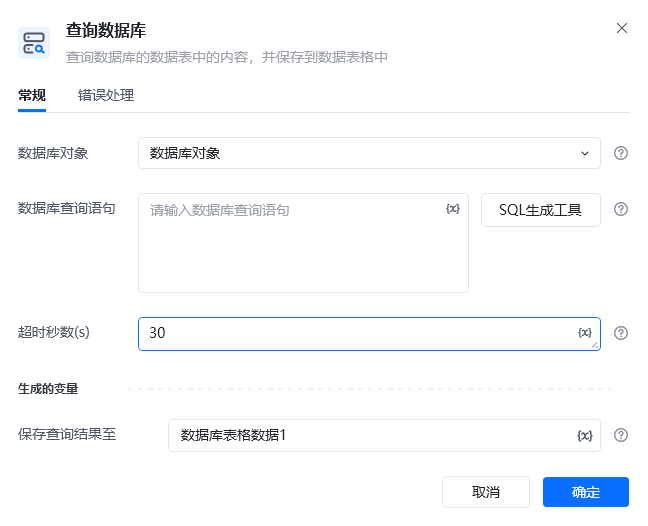
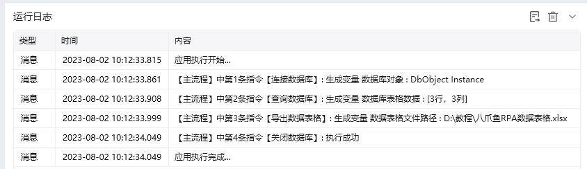
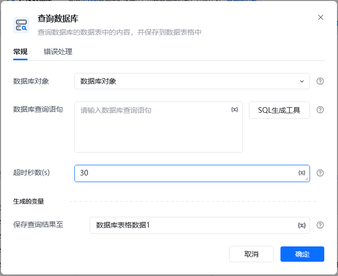
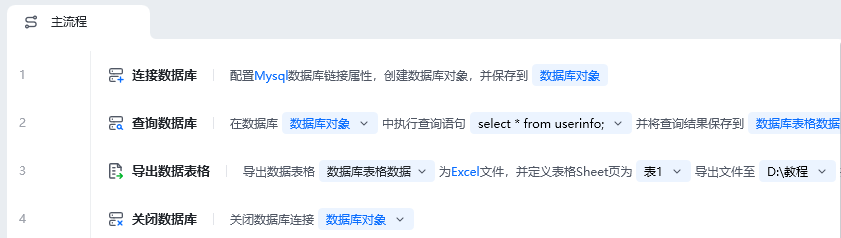
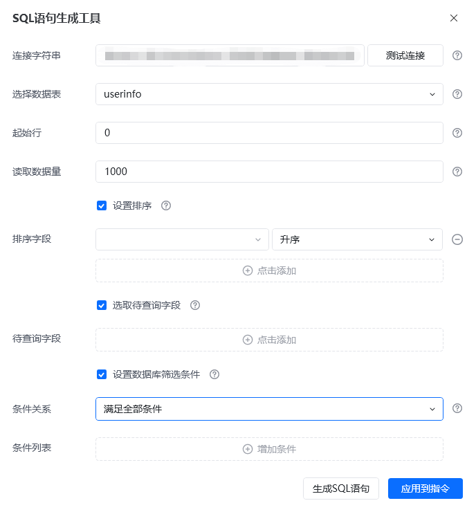

## 指令说明

**描述：**查询数据库的数据表中的内容，并保存到数据表格中

## 参数说明

<Tabs>
  <Tab title="常规">
    

    | 参数 | 说明 |
    | --- | --- |
    | **数据库对象** | 选择已经创建好的数据库对象 |
    | **数据库查询语句** | 输入数据库查询语句 |
    | **超时秒数（s）** | 设置数据库查询超时秒数 |
    | **SQL语句生成工具** | 选则要读取的起始行数和读取数据量 |
    | **连接字符串** | 输入数据库连接字符串，点击测试连接显示测试连接成功 |
    | **选择数据库表** | 选则要读取的数据库表 |
    | **起始行** | 输入读取的起始行号 |
    | **读取数据量** | 输入要读取的数据量，默认为1000 |
    | **排序字段** | 设置排序字段名和排序方式 |
    | **待查询字段** | 选择要查询的字段名 |
    | **条件关系** | 选择数据库筛选条件，满足全部条件、满足任意条件 |
    | **条件列表** | 选择待筛选的字段和条件 |
  </Tab>
  <Tab title="高级">
    本指令暂无高级参数。
  </Tab>
</Tabs>

## 使用示例

**该流程执行逻辑：**

使用【连接数据库】配置Mysql连接，创建数据库对象，并保存到数据库对象

使用【查询数据库】执行查询语句"select * from userinfo;"，将结果保存到数据库表格数据

使用【导出数据表格】导出数据库表格为Excel文件，并定义表格Sheet页为表1

使用【关闭数据库】指令关闭数据库连接

### 运行结果

<Info>
  使用指令过程中遇到问题？前往 [八爪鱼RPA 开发者社区问答板块](https://rpa.bazhuayu.com/community/questions) 提问，获取官方与社区帮助。
</Info>
