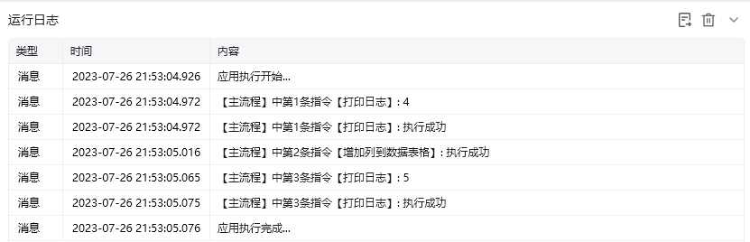

## 指令说明

**描述：** 增加一列到数据表格

## 参数说明

<Tabs>
  <Tab title="常规">
    

    | 参数 | 说明 |
    | --- | --- |
    | **数据表格** | 选择一个获取到的或者通过"导入Excel/CSV至数据表格"创建的数据表格对象 |
    | **列名** | 填写要添加列的列名 |
  </Tab>
  <Tab title="高级">
    本指令暂无高级参数。
  </Tab>
</Tabs>

## 使用示例

**该流程执行逻辑：**

1. 使用【打印日志】输出“数据表格1”的初始列数，本例为 4 列。
2. 执行【增加列到数据表格】，在“数据表格1”中新增一列。
3. 再次打印列数，结果变为 5，说明新列已经成功加入数据表格。

### 效果展示

<Info>
  使用指令过程中遇到问题？前往 [八爪鱼RPA 开发者社区问答板块](https://rpa.bazhuayu.com/community/questions) 提问，获取官方与社区帮助。
</Info>
