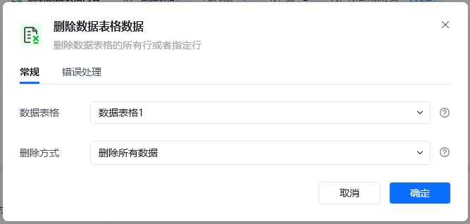
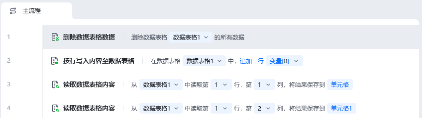
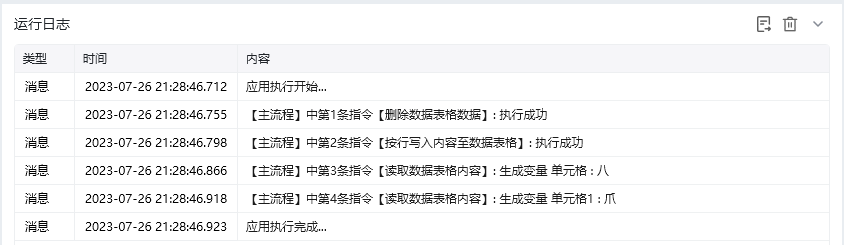

## 指令说明

**描述：** 删除数据表格的所有行或者指定行

## 参数说明

<Tabs>
  <Tab title="常规">
    

    | 参数 | 说明 |
    | --- | --- |
    | **数据表格** | 选择一个获取到的或者通过"导入Excel/CSV至数据表格"创建的数据表格对象 |
    | **删除方式** | 删除所有数据 / 删除指定行 |
  </Tab>
  <Tab title="高级">
    本指令暂无高级参数。
  </Tab>
</Tabs>

## 使用示例

**该流程执行逻辑：**

使用【**删除数据表格数据**】指令将数据表格1的所有数据删除

使用【**按行写入内容至数据表格**】指令在数据表格1中追加一行数据：八，爪，鱼

读取数据表格单元格(1,1)中的内容，读取成功

读取数据表格单元格(1,2)中的内容，读取成功

### 运行结果

<Info>
  使用指令过程中遇到问题？前往 [八爪鱼RPA 开发者社区问答板块](https://rpa.bazhuayu.com/community/questions) 提问，获取官方与社区帮助。
</Info>
