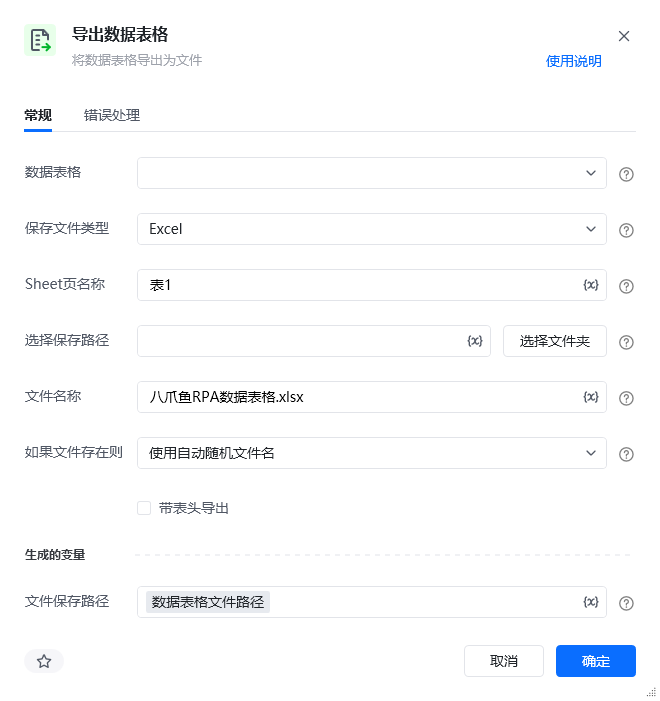
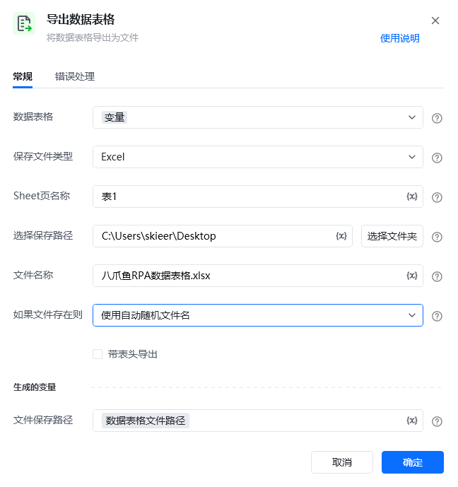

## 指令说明

**描述：** 将数据表格导出为文件

## 参数说明

<Tabs>
  <Tab title="常规">
    

    | 参数 | 说明 |
    | --- | --- |
    | **数据表格** | 选择一个获取到的或者通过"导入Excel/CSV至数据表格"创建的数据表格对象 |
    | **保存文件类型** | 支持Excel / CSV |
    | **Sheet页名称** | 为导出的Excel文件的Sheet页指定名称 |
    | **选择保存路径** | 选择导出文件的路径 |
    | **文件名称** | 为文件命名 |
    | **如果文件存在则** | 如果有相同文件名的文件存在则需要选择覆盖此文件还是使用自动随机文件名 |
    | **带表头导出** | 是否导出列头信息 |
  </Tab>
  <Tab title="高级">
    本指令暂无高级参数。
  </Tab>
</Tabs>

## 使用示例

**该流程执行逻辑：**

使用【**导出数据表格**】指令导出数据表格到指定路径并保存文件路径为变量

### 运行结果

<Info>
  使用指令过程中遇到问题？前往 [八爪鱼RPA 开发者社区问答板块](https://rpa.bazhuayu.com/community/questions) 提问，获取官方与社区帮助。
</Info>
