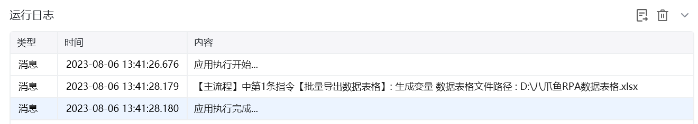

## 指令说明

**描述：** 将多个数据表格合并导出为一个表格文件

## 参数说明

<Tabs>
  <Tab title="常规">
    

    | 参数 | 说明 |
    | --- | --- |
    | **数据表格列表** | 点击添加可选择多个数据列表表格 |
    | **选择保存路径** | 选择要导出的文件路径 |
    | **文件名称** | 指定导出文件名称，如果文件存在则可以使用自动随机文件名，覆盖同名表格数据 |
    | **带表头导出** | 选择是否带表头导出文件 |
    | **文件保存路径** | 保存导出文件的路径为变量 |
  </Tab>
  <Tab title="高级">
    本指令暂无高级参数。
  </Tab>
</Tabs>

## 使用示例

**该流程执行逻辑：**

使用【**批量导出数据表格**】指令批量导出数据表格并保存到文件路径

### 运行结果

<Info>
  使用指令过程中遇到问题？前往 [八爪鱼RPA 开发者社区问答板块](https://rpa.bazhuayu.com/community/questions) 提问，获取官方与社区帮助。
</Info>
