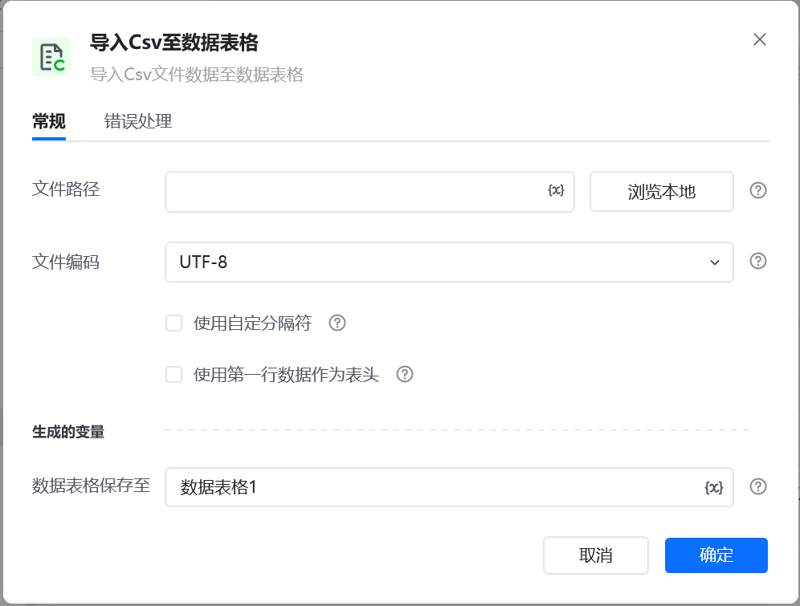
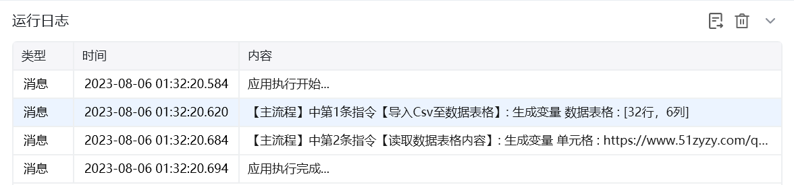

## 指令说明

**描述：** 导入Csv数据到数据表格

## 参数说明

<Tabs>
  <Tab title="常规">
    

    | 参数 | 说明 |
    | --- | --- |
    | **CSV文件路径** | 目标文件的绝对路径，从盘符开始，如："D:\八爪鱼rpa.csv" |
    | **文件编码** | 系统默认 / UTF-8 / ASCII / UTF-8 Bom / Unicode / GBK / GB2312 |
    | **使用自定义分隔符** | 可以自定义分隔符 |
    | **使用第一行数据为表头** | 第一行数据作为表头 |
    | **数据表格保存至** | 保存读取到的CSV数据为变量，变量类型为二维列表 |
  </Tab>
  <Tab title="高级">
    本指令暂无高级参数。
  </Tab>
</Tabs>

## 使用示例

**该流程执行逻辑：**

使用【**导入Csv数据表格**】指令读取指定文件并保存读取结果

执行【**读取数据表格内容**】指令读取单元格的内容

### 运行结果

<Info>
  使用指令过程中遇到问题？前往 [八爪鱼RPA 开发者社区问答板块](https://rpa.bazhuayu.com/community/questions) 提问，获取官方与社区帮助。
</Info>
