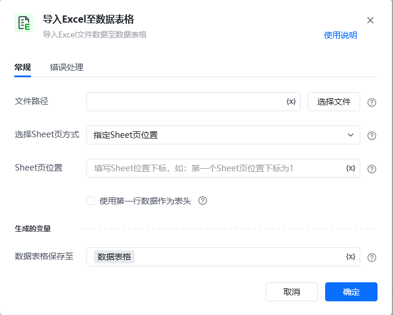
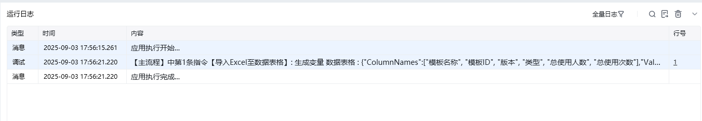

## 指令说明

**描述：** 导入本地的Excel表格数据到数据表格

## 参数说明

<Tabs>
  <Tab title="常规">
    

    | 参数 | 说明 |
    | --- | --- |
    | **文件路径** | 目标文件的绝对路径，支持xls、xlsx格式的数据文件 |
    | **选择Sheet页方式** | 指定Sheet页位置 / 指定Sheet页名称 |
    | **Sheet页位置** | 指定要导入的Sheet页位置下标，第一个Sheet页为1 |
    | **使用第一行数据作为表头** | 使用Excel文件中的第一行数据作为数据表格的表头信息 |
    | **数据表格保存至** | 保存读出到内容为变量 |
  </Tab>
  <Tab title="高级">
    本指令暂无高级参数。
  </Tab>
</Tabs>

## 使用示例

**该流程执行逻辑：**

使用【**导入Excel至数据表格**】指令导入指定文件中的第一个Sheet页数据到数据表格中，保存至数据表格变量中。

### 效果展示

<Info>
  使用指令过程中遇到问题？前往 [八爪鱼RPA 开发者社区问答板块](https://rpa.bazhuayu.com/community/questions) 提问，获取官方与社区帮助。
</Info>
