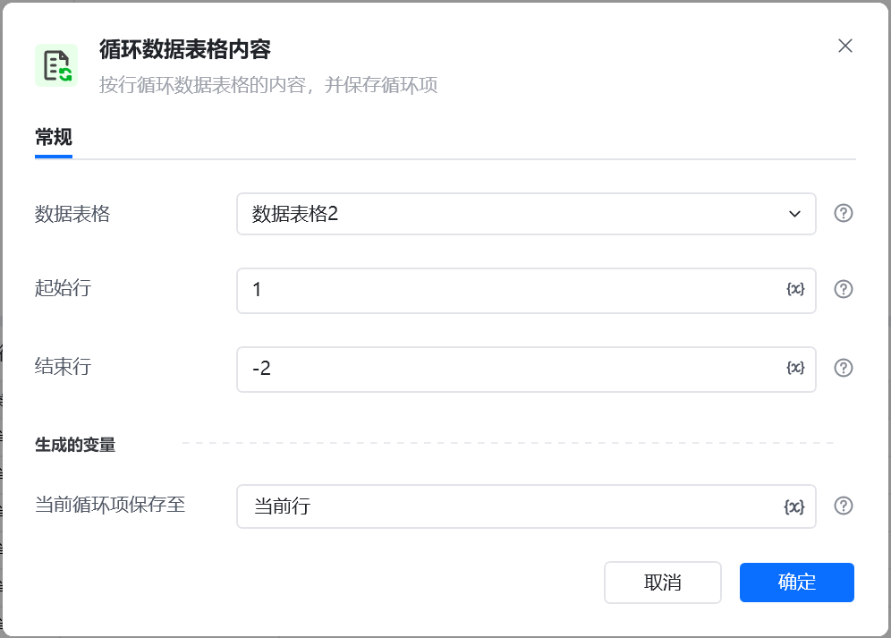
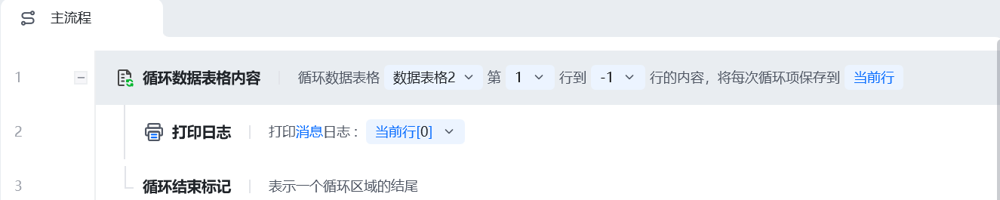
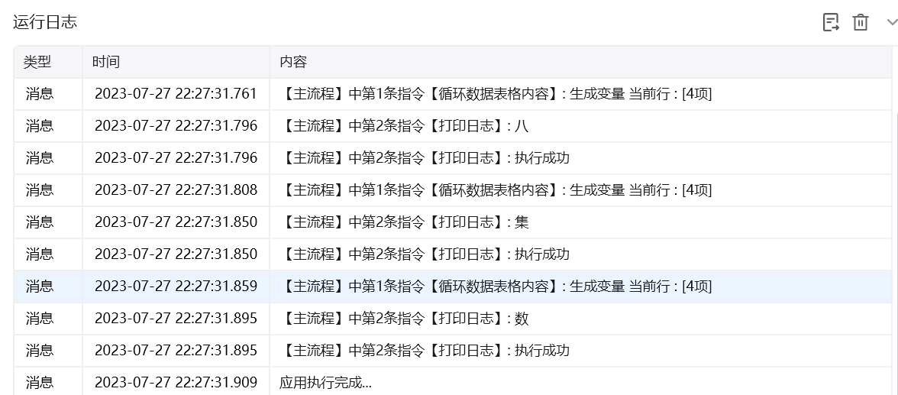

## 指令说明

**描述：** 按行循环数据表格的内容，并保存循环项

## 参数说明

<Tabs>
  <Tab title="常规">
    

    | 参数 | 说明 |
    | --- | --- |
    | **数据表格** | 选择一个获取到的或者通过"导入Excel/CSV至数据表格"创建的数据表格对象 |
    | **起始行** | 循环起始行号，行号从1开始 |
    | **结束行** | 循环结束行号，-1表示倒数第一行 |
    | **当前循环项保存至** | 保存当前循环到的内容为变量 |
  </Tab>
  <Tab title="高级">
    本指令暂无高级参数。
  </Tab>
</Tabs>

## 使用示例

**该流程执行逻辑：**

使用【**循环数据表格内容**】指令循环数据表格2的第1行到最后一行，将循环保存至：当前行

循环体执行【**打印日志**】指令打印当前循环项行的第一个单元格

直至结束行则循环结束

### 运行结果

<Info>
  使用指令过程中遇到问题？前往 [八爪鱼RPA 开发者社区问答板块](https://rpa.bazhuayu.com/community/questions) 提问，获取官方与社区帮助。
</Info>
