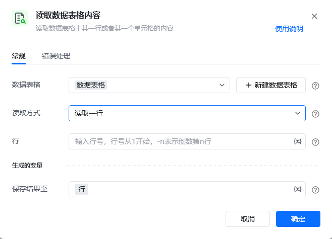
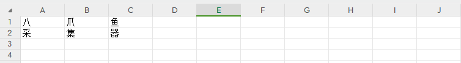
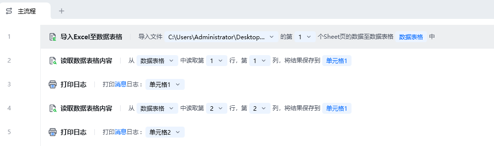

## 指令说明

**描述：** 从数据表格中读取内容，支持矩形区域范围读取

## 参数说明

<Tabs>
  <Tab title="常规">
    

    | 参数 | 说明 |
    | --- | --- |
    | **数据表格** | 选择一个获取到的或者通过"导入Excel/CSV至数据表格"创建的数据表格对象 |
    | **读取方式** | 下拉选择：读取一行（按行读取数据表格内容）、读取单元格（按单元格读取数据表格内容） |
    | **行号** | 行号从1开始，-n表示倒数第n行 |
    | **保存结果至** | 保存读取到内容为变量 |
  </Tab>
  <Tab title="高级">
    本指令暂无高级参数。
  </Tab>
</Tabs>

## 使用示例

**该流程执行逻辑：**

使用【**导入Excel至数据表格**】打开已有的Excel，指令对指定Sheet页位置进行

使用【**读取数据表格内容**】指令，分别读取指定单元格的第n行，第n列

执行【**打印日志**】指令分别打印保存结果

### 运行结果

<Info>
  使用指令过程中遇到问题？前往 [八爪鱼RPA 开发者社区问答板块](https://rpa.bazhuayu.com/community/questions) 提问，获取官方与社区帮助。
</Info>
