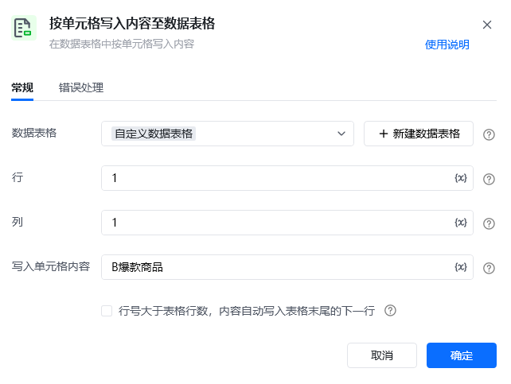
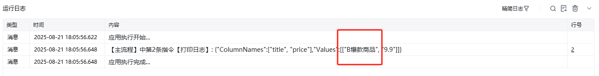

## 指令说明

**描述：** 在数据表格中按单元格写入内容（更改数据表格中某单元格的内容）

## 参数说明

<Tabs>
  <Tab title="常规">
    

    | 参数 | 说明 |
    | --- | --- |
    | **数据表格** | 选择一个获取到的或者通过"导入Excel/CSV至数据表格"创建的数据表格对象 |
    | **行** | 输入行号，行号从1开始，-n表示倒数第n行 |
    | **列** | 输入列名/列号，列号从1开始，-n表示倒数第n列 |
    | **写入单元格内容** | 数据写入单元格的内容 |
    | **行号大于表格行数，内容字段写入表格末尾的下一行** | 行号大于表格行数，内容自动写入表格末尾行的下一行。例如：用户选择的数据表格共10行，此时用户设置的写入行为第15行，则第15行的内容会自动写入到第10行的下一行第11行中 |
  </Tab>
  <Tab title="高级">
    本指令暂无高级参数。
  </Tab>
</Tabs>

## 使用示例

**该流程执行逻辑：**

使用【按单元格写入内容至数据表格】指令将「自定义数据表格」的第一行第一列的单元格内容更新为："B爆款商品"；

并将「自定义数据表格」数据表格打印输出。

### 运行结果

<Info>
  使用指令过程中遇到问题？前往 [八爪鱼RPA 开发者社区问答板块](https://rpa.bazhuayu.com/community/questions) 提问，获取官方与社区帮助。
</Info>
