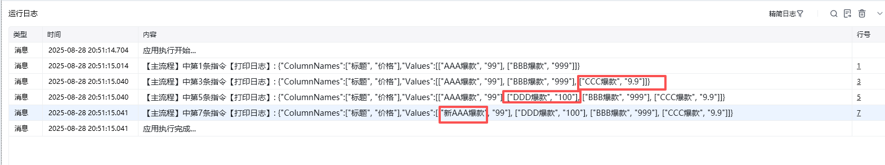

## 指令说明

**描述：** 在数据表格中按行写入内容，支持追加、插入或覆盖

## 参数说明

<Tabs>
  <Tab title="常规">
    

    | 参数 | 说明 |
    | --- | --- |
    | **数据表格** | 选择一个获取到的或者通过"导入Excel/CSV至数据表格"创建的数据表格对象 |
    | **写入方式** | 选择按行写入的方式：追加一行（在最后一行追加）、插入一行（需填写行号）、覆盖一行（需填写行号） |
    | **行** | 行号从1开始，-n表示倒数第n行 |
    | **输入方式** | 顺序行写入 / 指定列写入 |
    | **写入内容** | 输入要写入的内容 |
  </Tab>
  <Tab title="高级">
    本指令暂无高级参数。
  </Tab>
</Tabs>

## 使用示例

**该流程执行逻辑：**

打印「自定义数据表格」，方便与操作后的数据表格做对比；

使用【按行写入内容至数据表格】，写入方式选择「追加写入」，第1列追加写入内容"CCC爆款"，第2列追加写入内容"9.9"；更改后的数据表格内容参考日志行号3；

使用【按行写入内容至数据表格】，写入方式选择在「插入一行」到第二行中，第二行的内容变更为"DDD爆款""100"；更改后的数据表格内容参考日志行号5；

使用【按行写入内容至数据表格】，写入方式选择在「覆盖一行」，覆盖第1行，将第一行第一列的内容变更为"新AAA爆款"；更改后的数据表格内容参考日志行号7；

### 运行结果

<Info>
  使用指令过程中遇到问题？前往 [八爪鱼RPA 开发者社区问答板块](https://rpa.bazhuayu.com/community/questions) 提问，获取官方与社区帮助。
</Info>
