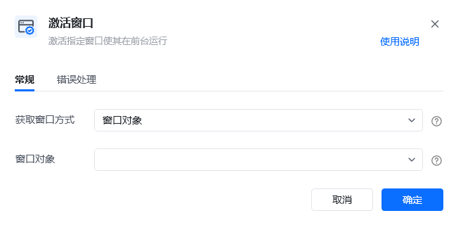
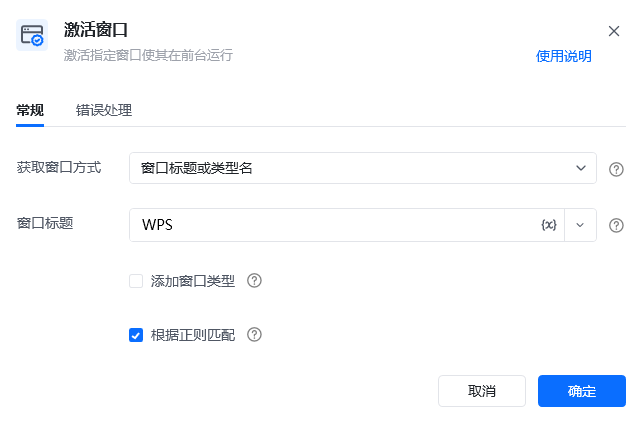

## 指令说明

**描述：** 激活指定窗口使其在前台运行。

<Info>
  被激活的窗口，请确保在任务栏中已被打开过。若未在任务栏中打开，可以先使用指令【启动任务程序】来打开指定的应用，再激活对应的窗口。
</Info>

## 参数说明

<Tabs>
  <Tab title="常规">
    

    | 参数 | 说明 |
    | --- | --- |
    | **获取窗口方式** | 选择获取窗口方式，窗口对象、窗口标题或类型名、捕获窗口元素 |
    | **窗口对象** | 输入一个通过"获取窗口对象"获取的窗口对象 |
    | **窗口标题** | 输入窗口标题，可添加窗口类型、是否正则匹配 |
    | **选择元素** | 选择要操作的目标元素 |
  </Tab>
  <Tab title="高级">
    本指令暂无高级参数。
  </Tab>
</Tabs>

## 使用示例

**该流程执行逻辑：**

使用【激活窗口】激活标题包含WPS的窗口。

### 效果展示

成功将指定窗口激活到前台。

### 使用小Tips

- 被激活的窗口，请确保在任务栏中已被打开过
- 若未在任务栏中打开，可以先使用指令【启动任务程序】来打开指定的应用，再激活对应的窗口

<Info>
  使用指令过程中遇到问题？前往 [八爪鱼RPA 开发者社区问答板块](https://rpa.bazhuayu.com/community/questions) 提问，获取官方与社区帮助。
</Info>
