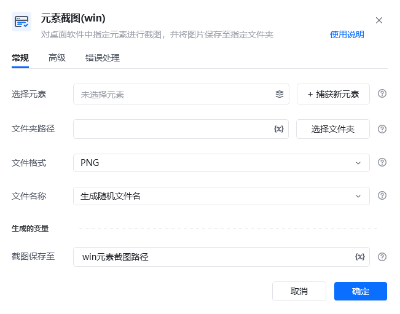
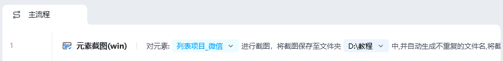
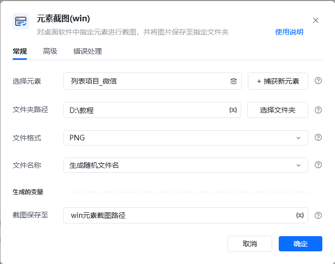

## 指令说明

**描述：** 对桌面软件中指定元素进行截图，并将图片保存至指定文件夹。

## 参数说明

| 参数 | 说明 |
| --- | --- |
| **选择元素** | 从元素库中选择一个已捕获的元素或通过「捕获新元素」来捕获新的桌面元素作为操作目标 |
| **文件夹路径** | 选择存储截图文件夹路径或写入文件夹路径 |
| **文件格式** | 选择保存图片文件的格式（JPEG，PNG） |
| **文件名称** | 生成随机文件名 / 自定义文件名 |

### 高级

| 参数 | 说明 |
| --- | --- |
| **等待元素存在(s)** | 等待目标元素存在的超时时间 |

## 使用示例

**该流程执行逻辑：**

使用【元素截图（win）】指令对桌面元素截图，并保存图片路径至win元素截图路径。

### 运行结果

成功对指定桌面元素截图并保存至指定文件夹。

<Info>
  使用指令过程中遇到问题？前往 [八爪鱼RPA 开发者社区问答板块](https://rpa.bazhuayu.com/community/questions) 提问，获取官方与社区帮助。
</Info>
