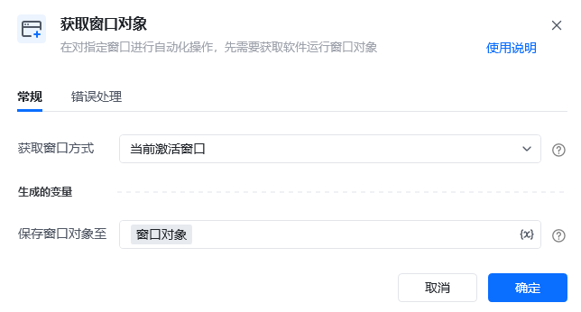
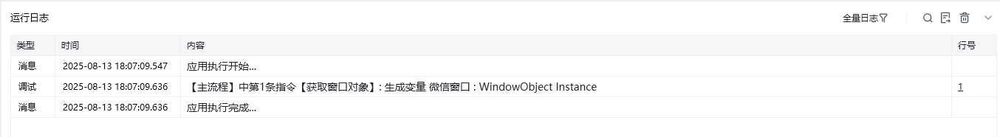

## 指令说明

**描述：** 桌面软件自动化中对指定窗口进行自动化操作，先需要获取软件运行窗口对象。

<Info>
  被获取的软件窗口，必须在电脑任务栏中挂着，使用前可先激活对应软件窗口。软件窗口名称可以将鼠标悬停在对应任务栏软件上就显示出来名称。
</Info>

## 参数说明

<Tabs>
  <Tab title="常规">
    

    | 参数 | 说明 |
    | --- | --- |
    | **获取窗口方式** | 当前激活窗口：选择一个当前正激活的窗口对象。窗口标题或者类型名：从当前可获取的窗口中选择目标窗口标题及类型名(可选)来选定窗口。捕获窗口元素：手动捕获操作目标所在的窗口对象。桌面：获取桌面为窗口对象 |
    | **窗口标题** | 选择「窗口标题或者类型名」时出现，输入想操作软件窗口的标题，或者下拉选择 |
    | **选择元素** | 选择「捕获窗口元素」时出现 |
    | **保存窗口对象至** | 该变量保存的是窗口对象，使用此窗口对象可以对窗口进行自动化操作，后续流程用到该窗口时，可直接调用该变量 |
  </Tab>
  <Tab title="高级">
    本指令暂无高级参数。
  </Tab>
</Tabs>

## 使用示例

**该流程执行逻辑：**

使用【获取窗口对象】指令，根据「窗口标题或者类型名」获取"微信"的软件窗口。

### 运行结果

成功获取指定软件的窗口对象，保存到变量中供后续流程使用。

### 使用小Tips

- 被获取的软件窗口，必须在电脑任务栏中挂着，使用前可先激活对应软件窗口
- 软件窗口名称：可以将鼠标悬停在对应任务栏软件上就显示出来名称
- 只适用于常见大众的软件，其他软件可能不适配，具体可咨询售前人员

<Info>
  使用指令过程中遇到问题？前往 [八爪鱼RPA 开发者社区问答板块](https://rpa.bazhuayu.com/community/questions) 提问，获取官方与社区帮助。
</Info>
