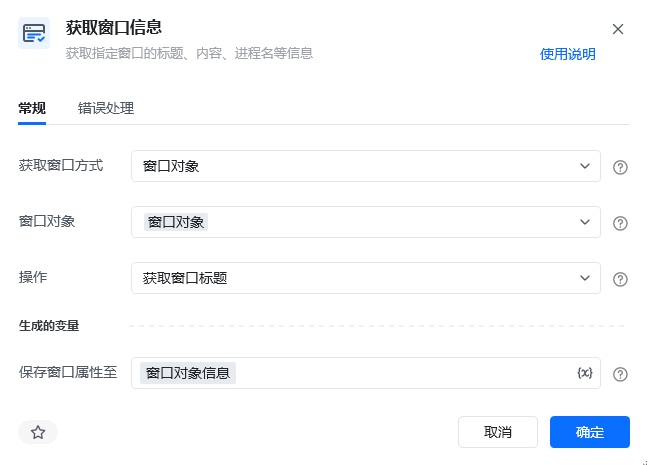
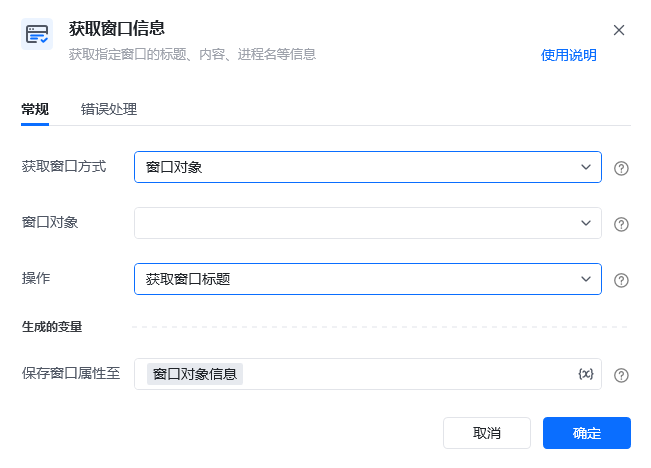

## 指令说明

**描述：**获取指定窗口的标题、内容、进程名等信息。

## 参数说明

| 参数 | 说明 |
| --- | --- |
| **获取窗口方式** | 窗口对象：选择界面已经存在的窗口。窗口标题或类型名：根据窗口的名称去获取窗口及添加窗口的类型，也可根据正则匹配目标，如^abc(以abc开头)、\d+(匹配数字)、.*\.csv$(匹配.csv结尾)等。捕获窗口元素：手动捕获一个窗口元素，或选择已捕获的窗口元素 |
| **窗口对象** | 输入一个通过"获取窗口对象"获取的窗口对象 |
| **选择元素** | 选择要操作的目标元素或手动捕获一个窗口元素 |
| **操作** | 选择一种对窗口的操作方式，如：获取窗口标题、获取窗口内容、获取窗口进程名 |

## 使用示例

**此流程执行逻辑：**

【获取窗口信息】根据窗口名称为"企业微信"获取这个窗口的标题保存到变量"窗口名称"中。

### 运行结果

成功获取指定窗口的信息并保存到变量中。

<Info>
  使用指令过程中遇到问题？前往 [八爪鱼RPA 开发者社区问答板块](https://rpa.bazhuayu.com/community/questions) 提问，获取官方与社区帮助。
</Info>
