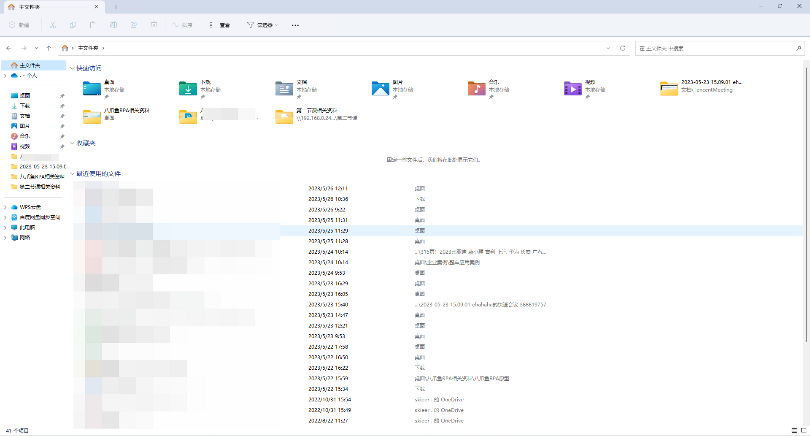
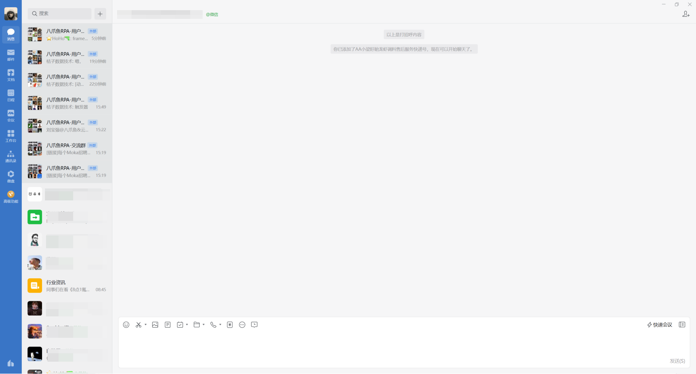
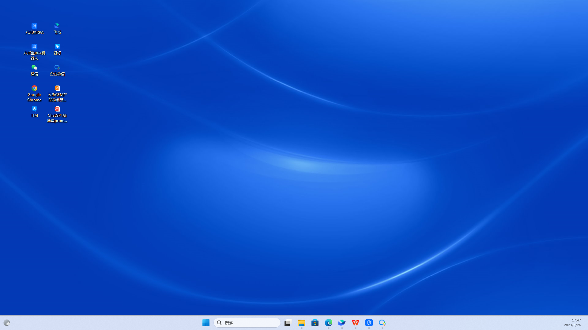
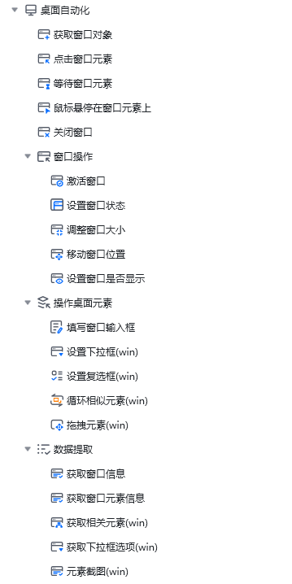
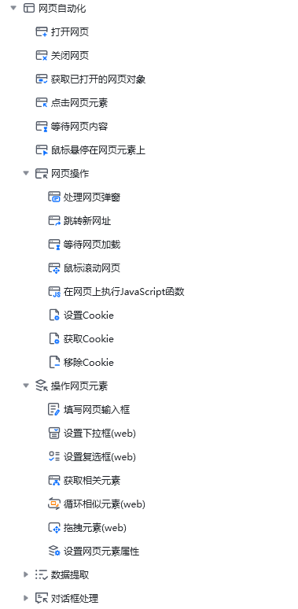

桌面软件分为：应用软件、系统软件、桌面窗口

**应用软件**

应用软件就是我们在电脑上下载安装的软件，例如：微信、钉钉、企业微信、飞书、WPS等这一类应用软件。

**系统软件**

系统软件就是我们电脑操作系统自带的软件，例如：文件资源管理器、记事本、计算器等系统软件

**桌面窗口**

例如我们的电脑桌面，所以桌面软件的涵盖范围非常全面，打开电脑 每一处都属于桌面软件

**桌面自动化原理**

网页自动化中我们是在网页对象上对网页元素进行操作，桌面软件自动化中则是在窗口对象上对窗口元素进行操作。

因此桌面自动化跟网页自动化的指令是区分开来使用的

<Info>
  使用过程中遇到问题？前往 [八爪鱼RPA 开发者社区问答板块](https://rpa.bazhuayu.com/community/questions) 提问，获取官方与社区帮助。
</Info>
