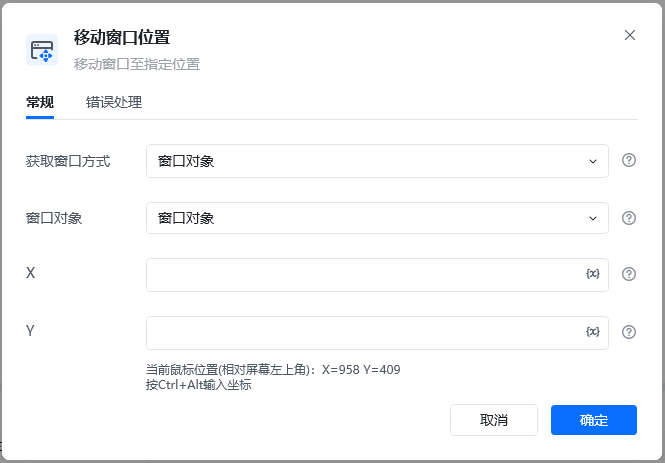

## 指令说明

**描述：**移动窗口至指定位置。

## 参数说明

| 参数 | 说明 |
| --- | --- |
| **获取窗口方式** | 选择获取窗口方式，窗口对象、窗口标题或类型名、捕获窗口元素 |
| **窗口对象** | 输入一个通过"获取窗口对象"获取的窗口对象 |
| **窗口标题** | 输入窗口标题，可添加窗口类型、是否正则匹配 |
| **窗口类型** | 输入窗口类型 |
| **选择元素** | 选择要操作的目标元素 |
| **X** | 输入窗口移动到目标的横坐标X（按Ctrl+Alt输入坐标） |
| **Y** | 输入窗口移动到目标的纵坐标Y（按Ctrl+Alt输入坐标） |

## 使用示例

**该流程执行逻辑：**

使用【获取窗口对象】获取标题为Excel.xlsx-WPS Office的窗口，将窗口对象保存到窗口对象 → 使用【移动窗口位置】设置窗口到指定位置。

### 运行结果

窗口已成功移动到指定坐标位置。

<Info>
  使用指令过程中遇到问题？前往 [八爪鱼RPA 开发者社区问答板块](https://rpa.bazhuayu.com/community/questions) 提问，获取官方与社区帮助。
</Info>
