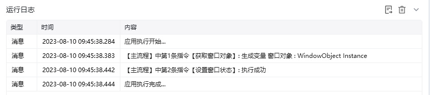

## 指令说明

**描述：**对指定窗口执行还原、最大化、最小化操作。

## 参数说明

<Tabs>
  <Tab title="常规">
    

    | 参数 | 说明 |
    | --- | --- |
    | **获取窗口方式** | 选择获取窗口方式，窗口对象、窗口标题或类型名、捕获窗口元素 |
    | **窗口对象** | 获取窗口方式选择"窗口对象"时需要填写，输入一个通过"获取窗口对象"获取的窗口对象 |
    | **窗口标题** | 输入窗口标题，可添加窗口类型、是否正则匹配 |
    | **窗口类型** | 输入窗口类型 |
    | **选择元素** | 选择要操作的目标元素 |
    | **要设置的窗口状态** | 选择要设置的窗口状态，还原、最大化窗口、最小化窗口 |
  </Tab>
  <Tab title="高级">
    本指令暂无高级参数。
  </Tab>
</Tabs>

## 使用示例

**此流程执行逻辑：**

获取标题为Excel.xlsx-WPS Office的窗口对象 → 使用【设置窗口状态】指令将窗口对象最大化。

### 运行结果

窗口状态已成功设置为最大化。

<Info>
  使用指令过程中遇到问题？前往 [八爪鱼RPA 开发者社区问答板块](https://rpa.bazhuayu.com/community/questions) 提问，获取官方与社区帮助。
</Info>
