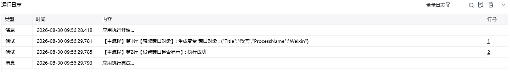

## 指令说明

**描述：** 设置窗口是否显示。

## 参数说明

<Tabs>
  <Tab title="常规">
    

    | 参数 | 说明 |
    | --- | --- |
    | **获取窗口方式** | 选择获取窗口方式，窗口对象、窗口标题或类型名、捕获窗口元素 |
    | **窗口对象** | 输入一个通过"获取窗口对象"获取的窗口对象 |
    | **窗体可见性** | 对窗口选择设置：显示窗口、隐藏窗口 |
  </Tab>
  <Tab title="高级">
    本指令暂无高级参数。
  </Tab>
</Tabs>

## 使用示例

**该流程执行逻辑：**

使用【获取窗口对象】获取目标窗口。
使用【设置窗口是否显示】将窗口设置为显示状态。

### 效果展示

执行完成后，目标窗口将按配置显示。

<Info>
  使用指令过程中遇到问题？前往 [八爪鱼RPA 开发者社区问答板块](https://rpa.bazhuayu.com/community/questions) 提问，获取官方与社区帮助。
</Info>
