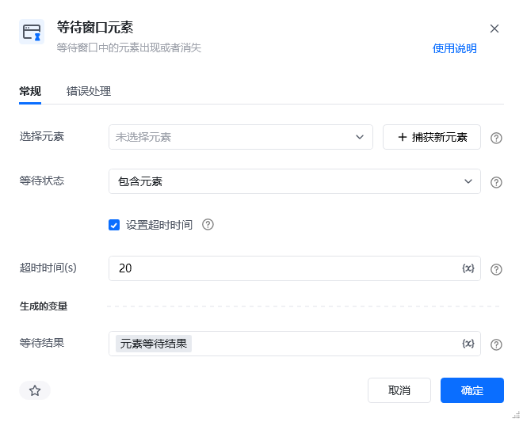
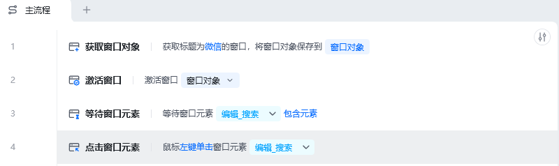
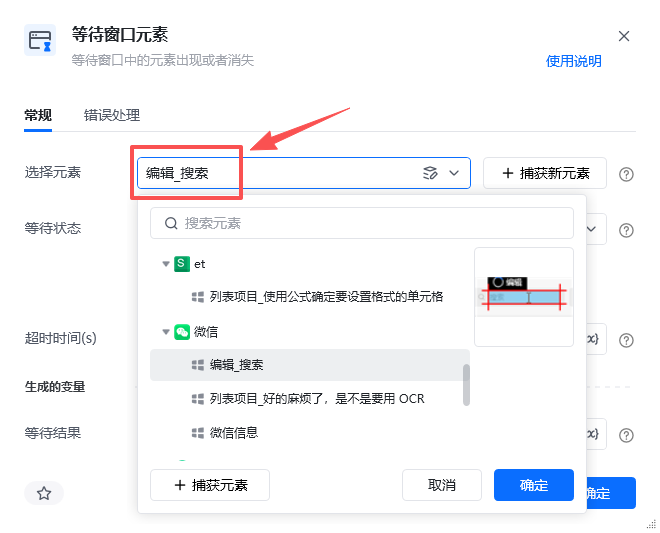

## 指令说明

**描述：** 等待窗口中的元素出现或者消失。

## 参数说明

<Tabs>
  <Tab title="常规">
    

    | 参数 | 说明 |
    | --- | --- |
    | **选择元素** | 选择要操作的目标元素，可以是已存在的元素或直接"捕获新元素" |
    | **等待状态** | 选择等待状态，选项为包含元素、不包含元素 |
    | **设置超时时间** | 勾选框，若勾选，需要设置等待超时时间，超时后流程将自动往下执行 |
    | **超过时间（s）** | 设置最大等待时间 |
  </Tab>
  <Tab title="高级">
    本指令暂无高级参数。
  </Tab>
</Tabs>

## 使用示例

**该流程执行逻辑：**

获取标题为微信的窗口对象 → 激活微信窗口对象 → 使用【等待窗口元素】等待微信窗口对象包含指定元素"编辑框" → 鼠标左键单击窗口元素"编辑框"。

### 效果展示

RPA 成功等待指定元素出现后继续执行后续操作。

<Info>
  使用指令过程中遇到问题？前往 [八爪鱼RPA 开发者社区问答板块](https://rpa.bazhuayu.com/community/questions) 提问，获取官方与社区帮助。
</Info>
