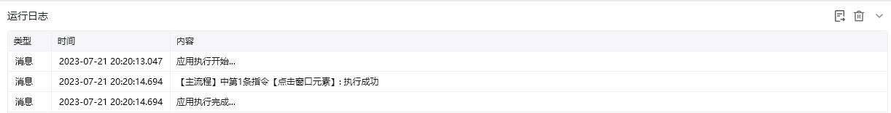
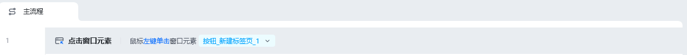
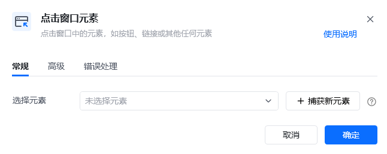

## 指令说明

**描述：**点击窗口中的元素，如按钮、链接或其他任何元素。

## 参数说明

<Tabs>
  <Tab title="常规">
    

    | 参数 | 说明 |
    | --- | --- |
    | **选择元素** | 从窗口元素库中选择一个已捕获的元素或通过「捕获新元素」来捕获新的窗口元素作为操作目标 |
  </Tab>
  <Tab title="高级">
    

    | 参数 | 说明 |
    | --- | --- |
    | **点击方式** | 鼠标单击 / 鼠标双击 |
    | **鼠标按钮** | 鼠标左键 / 鼠标右键 |
    | **辅助按钮** | 无 / Alt / Ctrl / Shift |
    | **点击位置** | 元素中心点 / 元素左上角 / 元素左下角 / 元素右上角 / 元素右下角 |
    | **横向偏移量(px)** | 基于点击位置，水平方向的额外偏移量(像素)。正值表示向右偏移，负值表示向左偏移。默认值为0 |
    | **纵向偏移量(px)** | 基于点击位置，垂直方向的额外偏移量(像素)。正值表示向下偏移，负值表示向上偏移。默认值为0 |
    | **执行后延迟(s)** | 指令执行完成后的等待时间 |
    | **等待元素存在(s)** | 等待目标元素存在的超时时间 |
  </Tab>
</Tabs>

## 使用示例

**该流程执行逻辑：**

使用【点击窗口元素】指令在窗口对象中模拟人工鼠标左键单击浏览器窗口的新建网页按钮。

### 运行结果

成功点击窗口中的目标元素，触发相应的操作。

<Info>
  使用指令过程中遇到问题？前往 [八爪鱼RPA 开发者社区问答板块](https://rpa.bazhuayu.com/community/questions) 提问，获取官方与社区帮助。
</Info>
