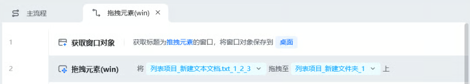

## 指令说明

**描述：** 把桌面元素拖拽到指定位置。

## 参数说明

<Tabs>
  <Tab title="常规">
    

    | 参数 | 说明 |
    | --- | --- |
    | **选择元素** | 从元素库中选择已捕获过的元素，或重新捕获元素 |
    | **拖拽方式** | 拖拽至目标点：通过像素定位目标位置。按Ctrl+Alt可快捷输入坐标，即相对于屏幕左上角的当前鼠标所在位置。 拖拽至目标元素上：把元素拖到指定的元素上面 |
  </Tab>
  <Tab title="高级">
    

    | 参数 | 说明 |
    | --- | --- |
    | **执行后延迟(s)** | 指令执行完成后的等待时间 |
    | **移动速度** | 选择鼠标的移动速度，选项为：瞬间、快速、中速、慢速 |
    | **等待元素存在(s)** | 等待目标元素存在的超时时间 |
  </Tab>
</Tabs>

## 使用示例

**该流程执行逻辑：**

【获取窗口对象】获取名称为"拖拽元素"的窗口 → 【拖拽元素(win)】把文本文件元素拖拽到文件夹元素上面。

### 效果展示

成功将元素拖拽到目标位置。

<Info>
  使用指令过程中遇到问题？前往 [八爪鱼RPA 开发者社区问答板块](https://rpa.bazhuayu.com/community/questions) 提问，获取官方与社区帮助。
</Info>
