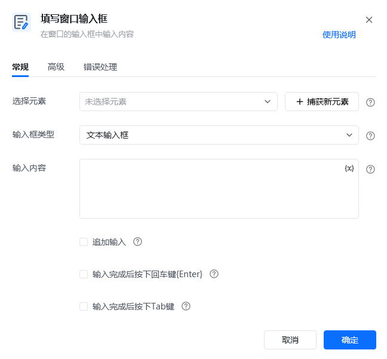
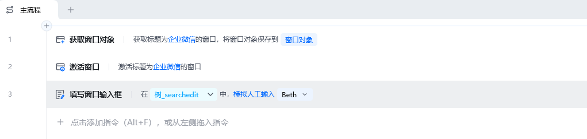
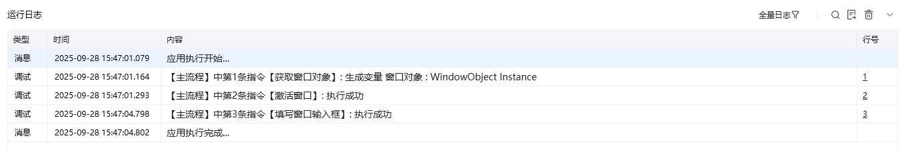
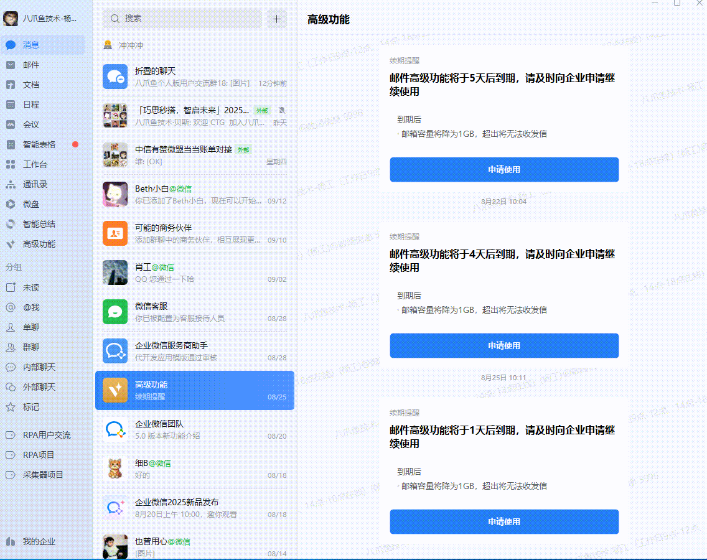

## 指令说明

**描述：**在窗口的输入框中输入内容。

## 参数说明

| 参数 | 说明 |
| --- | --- |
| **选择元素** | 从元素库中选择或直接捕获输入框元素 |
| **输入框类型** | 选择输入框类型为"文本输入框"或"密码输入框" |
| **输入内容** | 选择现有变量或直接输入内容 |
| **追加输入** | 勾选则在输入框的现有内容后继续追加新的输入内容，否则清空输入框现有内容后再进行输入 |
| **输入完成后按下回车键** | 在完成内容输入后，使用模拟人工输入方式按下回车键{Enter} |
| **输入完成后按下Tab键** | 在完成内容输入后，使用模拟人工输入方式按下Tab键 |

### 高级

| 参数 | 说明 |
| --- | --- |
| **输入方式** | 模拟人工输入：模拟人工的方式触发输入事件。自动化接口输入：调用元素自身实现的自动化接口输入 |
| **输入内容包含快捷键** | 可以在输入内容中加入快捷键，如{enter}代表输入回车键 |
| **输入前点击元素** | 在执行输入动作前，先点击元素，以便获取焦点 |
| **焦点超时时间(ms)** | 设置焦点超时时间(ms)，元素获取焦点后等待指定时间后进行输入操作 |
| **执行后延迟(s)** | 指令执行完成后的等待时间 |
| **等待元素存在(s)** | 等待目标元素存在的超时时间 |

## 使用示例

**该流程执行逻辑：**

获取窗口对象：企业微信 → 激活「企业微信」窗口 → 使用指令【填写窗口输入框】，在「企业微信」搜索框中进行输入并回车。

### 运行结果

成功在目标输入框中输入指定内容。

<Info>
  使用指令过程中遇到问题？前往 [八爪鱼RPA 开发者社区问答板块](https://rpa.bazhuayu.com/community/questions) 提问，获取官方与社区帮助。
</Info>
