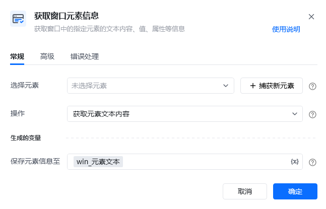
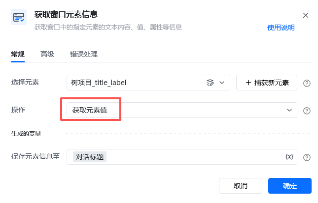

## 指令说明

**描述：** 获取窗口中的指定元素的文本内容、值、属性等信息。

## 参数说明

<Tabs>
  <Tab title="常规">
    

    | 参数 | 说明 |
    | --- | --- |
    | **选择元素** | 选择元素库里现有的元素，或捕获新元素：按住Ctrl键，在窗口中点中目标元素 |
    | **操作** | 获取元素文本内容、获取元素值、获取元素属性、获取元素位置 |
  </Tab>
  <Tab title="高级">
    | 参数 | 说明 |
    | --- | --- |
    | **等待元素存在（S）** | 等待目标元素存在的超时时间 |
  </Tab>
</Tabs>

## 使用示例

**该流程执行逻辑：**

获取窗口对象：企业微信 → 激活「企业微信」窗口 → 使用指令【获取窗口元素信息】，在「企业微信」中捕获当前对话框的title元素，获取元素值，打印输出。

### 运行结果

成功获取窗口元素信息并打印输出。

<Info>
  使用指令过程中遇到问题？前往 [八爪鱼RPA 开发者社区问答板块](https://rpa.bazhuayu.com/community/questions) 提问，获取官方与社区帮助。
</Info>
