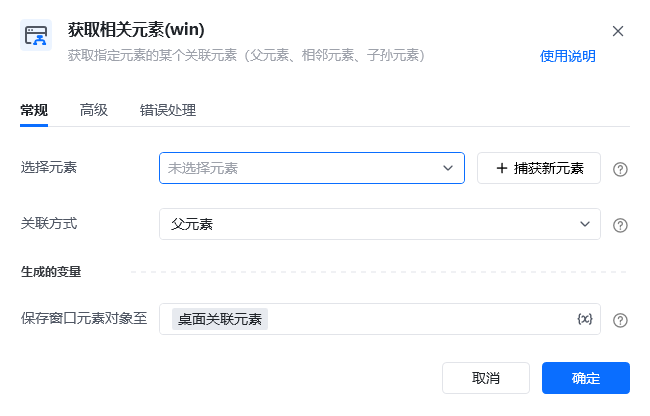
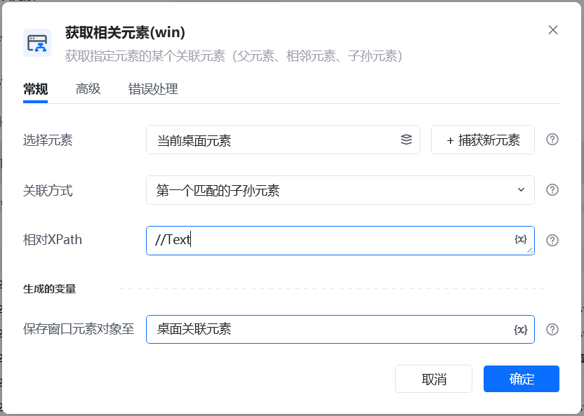

## 指令说明

**描述：** 获取指定元素的某个关联元素（父元素、相邻元素、子孙元素），一般配合循环相似元素一起使用。

## 参数说明

<Tabs>
  <Tab title="常规">
    

    | 参数 | 说明 |
    | --- | --- |
    | **选择元素** | 选择元素库里已捕获的元素，或捕获新元素：按住键盘Ctrl键，在窗口中点中目标元素 |
    | **关联方式** | 关联某个元素的父元素、前一个相邻元素、后一个相邻元素、第一个匹配的子孙元素、所有子元素、指定位置的子元素 |
    | **生成的变量** | 保存窗口元素对象至：指定一个变量名称，该变量用于保存获取到的元素对象，或选择保存至已创建过的元素 |
  </Tab>
  <Tab title="高级">
    | 参数 | 说明 |
    | --- | --- |
    | **等待元素存在（s）** | 等待目标元素存在的超时时间 |
  </Tab>
</Tabs>

## 使用示例

**此流程执行逻辑：**

【获取窗口对象】获取微信[搜一搜]窗口 → 【填写窗口输入框】输入"深圳大学"并回车 → 【点击窗口元素】点击"公众号"元素 → 【点击窗口元素】点击"深圳大学"公众号 → 【鼠标悬停在窗口元素上】→ 【滚动鼠标滚轮】→ 【循环相似元素(win)】循环每篇文章 → 【获取相关元素(win)】获取当前元素的第一个匹配的子孙元素 → 【循环结束标记】。

### 运行结果

成功获取关联元素并配合循环操作。

<Info>
  使用指令过程中遇到问题？前往 [八爪鱼RPA 开发者社区问答板块](https://rpa.bazhuayu.com/community/questions) 提问，获取官方与社区帮助。
</Info>
