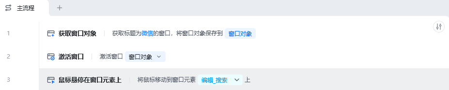
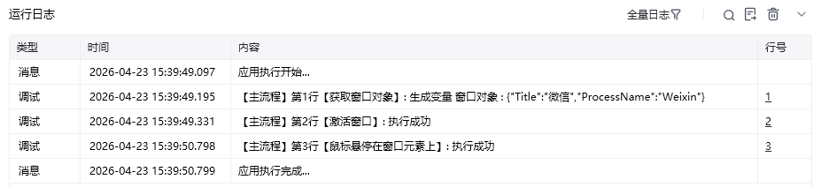

## 指令说明

**描述：** 将鼠标悬停在窗口的元素上。

## 参数说明

<Tabs>
  <Tab title="常规">
    

    | 参数 | 说明 |
    | --- | --- |
    | **选择元素** | 选择要操作的目标元素，可直接通过"捕获新元素"或直接选择已有元素 |
  </Tab>
  <Tab title="高级">
    | 参数 | 说明 |
    | --- | --- |
    | **执行后延迟（s）** | 输入指令执行完成后的等待时间 |
    | **等待元素存在（s）** | 输入等待目标元素存在的超时时间 |
  </Tab>
</Tabs>

## 使用示例

**该流程执行逻辑：**

获取标题为微信的窗口对象 → 使用【鼠标悬停在窗口元素上】将鼠标移动到微信编辑框元素上。

### 效果展示

鼠标成功悬停在指定窗口元素上。

<Info>
  使用指令过程中遇到问题？前往 [八爪鱼RPA 开发者社区问答板块](https://rpa.bazhuayu.com/community/questions) 提问，获取官方与社区帮助。
</Info>
