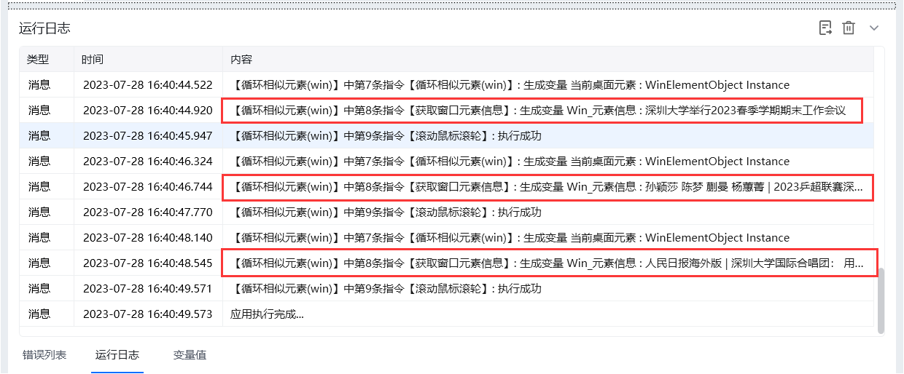
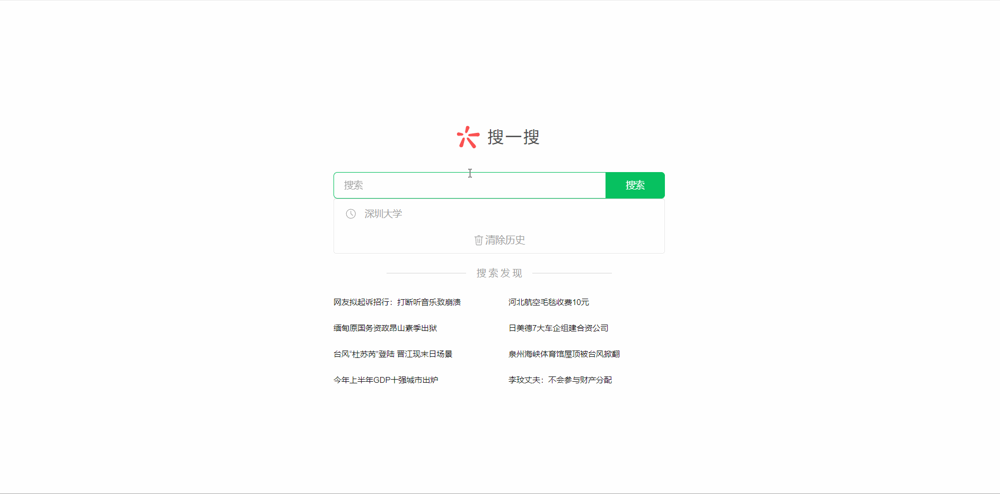

## 指令说明

**描述：** 依次循环窗口中的相似元素，也即是对相同xpath的元素进行循环，再对其每一项元素进行自动化操作。

## 参数说明

<Tabs>
  <Tab title="常规">
    

    | 参数 | 说明 |
    | --- | --- |
    | **选择元素** | 选择元素库里现有的元素，或捕获新元素：按住Shift键，依次选中两个相似元素 |
    | **输出当前循环位置** | 如果勾选，则会自动输出当前循环项在列表中的位置，从0开始 |
    | **保存当前循环项至** | 指定一个变量名称，用于存储一组相似元素中的当前循环项 |
  </Tab>
  <Tab title="高级">
    

    | 参数 | 说明 |
    | --- | --- |
    | **等待元素存在(s)** | 等待目标元素存在的超时时间 |
    | **倒序循环** | 如果勾选，将从相似元素的最后一个元素循环到第一个元素 |
  </Tab>
</Tabs>

## 使用示例

**该流程执行逻辑：**

【获取窗口对象】获取微信[搜一搜]窗口

【填写窗口输入框】在微信[搜一搜]窗口中的输入框输入"深圳大学"并按回车键`{Enter}`

【点击窗口元素】点击"公众号"元素

【点击窗口元素】点击"深圳大学"公众号

【鼠标悬停在窗口元素上】鼠标悬停在当前"深圳大学"公众号窗口上

【滚动鼠标滚轮】滚动鼠标1次

【循环相似元素(win)】循环每一篇文章的标题元素保存到"当前桌面元素"

【获取窗口元素信息】获取"当前桌面元素"的文本信息

【滚动鼠标滚轮】每循环一次鼠标滚动2次

【循环结束标记】循环结束。

### 效果展示

成功循环处理所有相似元素。

<Info>
  使用指令过程中遇到问题？前往 [八爪鱼RPA 开发者社区问答板块](https://rpa.bazhuayu.com/community/questions) 提问，获取官方与社区帮助。
</Info>
