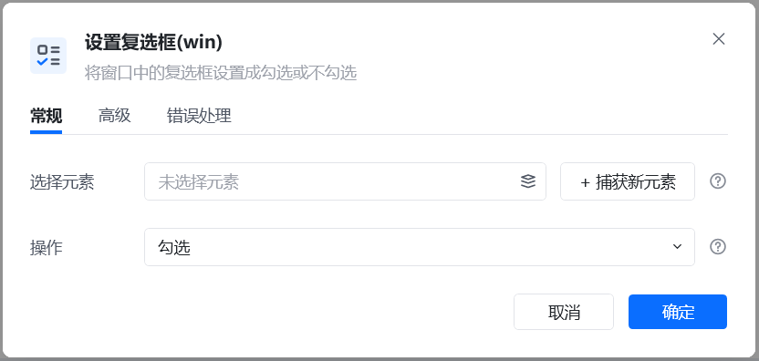
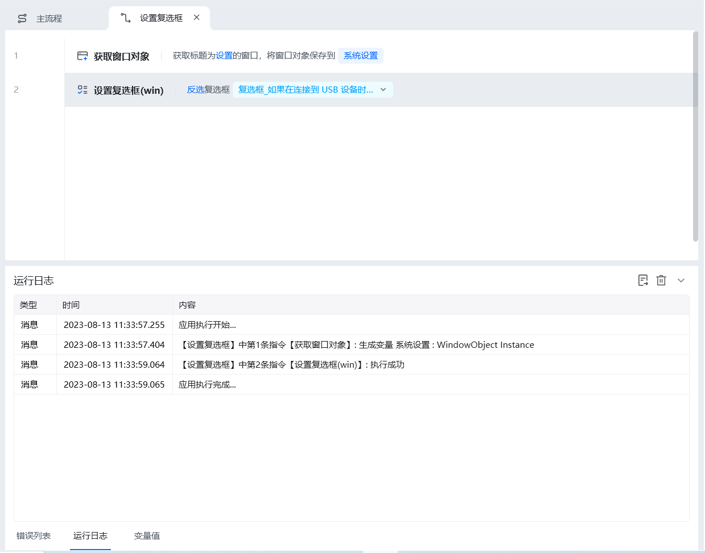
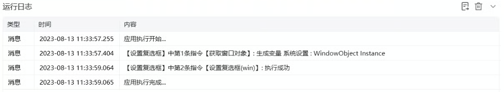

## 指令说明

**描述：** 将窗口中的复选框设置为勾选或不勾选。

## 参数说明

<Tabs>
  <Tab title="常规">
    

    | 参数 | 说明 |
    | --- | --- |
    | **选择元素** | 选择元素库已存在的复选框元素，或重新捕获新的复选框 |
    | **操作** | 勾选、取消勾选、反选三个设置 |
  </Tab>
  <Tab title="高级">
    本指令暂无高级参数。
  </Tab>
</Tabs>

## 使用示例

**该流程执行逻辑：**

【获取窗口对象】获取名称为"设置"的窗口 → 【设置复选框】在"设置"的窗口中，反选复选框。

### 运行结果

成功设置复选框的勾选状态。

<Info>
  使用指令过程中遇到问题？前往 [八爪鱼RPA 开发者社区问答板块](https://rpa.bazhuayu.com/community/questions) 提问，获取官方与社区帮助。
</Info>
