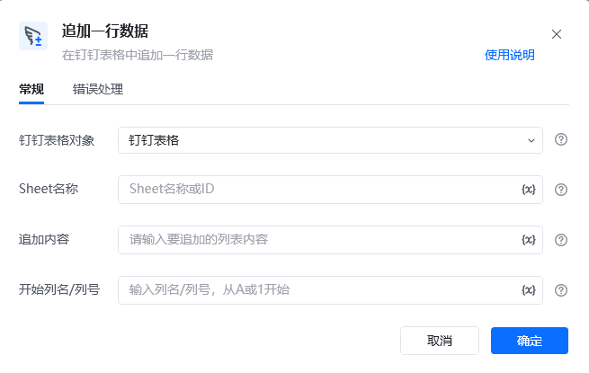
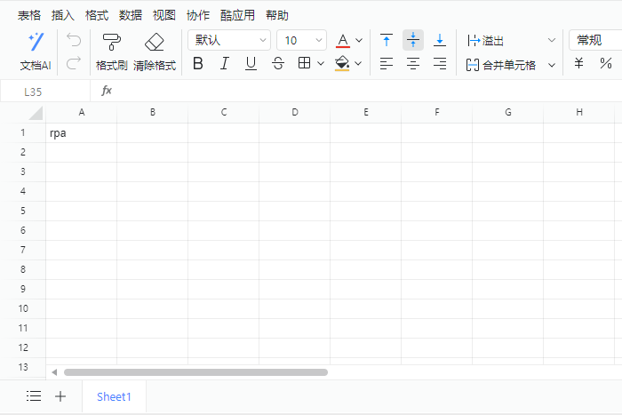

## 指令说明

**描述：** 在钉钉表格中追加一行数据

## 参数说明

<Tabs>
  <Tab title="常规">
    

    | 参数 | 说明 |
    | --- | --- |
    | **钉钉表格对象** | 选择需要操作的钉钉表格对象 |
    | **Sheet名称** | Sheet名称或ID，可直接输入或通过获取Sheet页名称获取 |
    | **追加内容** | 请输入要追加到表格末尾的列表内容 |
    | **开始列名/列号** | 请指定从哪一列开始追加写入 |
  </Tab>
  <Tab title="高级">
    本指令暂无高级参数。
  </Tab>
</Tabs>

## 使用示例

**该流程执行逻辑：**

使用【连接钉钉表格】建立钉钉表格连接

使用【新建列表】新建空的列表

使用【新插入数据到列表】在列表指定位置插入数据rpa

使用【追加一行数据】在钉钉表格的Sheet1页追加一行数据，插入新列表的数据

### 效果展示

<Info>
  使用指令过程中遇到问题？前往 [八爪鱼RPA 开发者社区问答板块](https://rpa.bazhuayu.com/community/questions) 提问，获取官方与社区帮助。
</Info>
